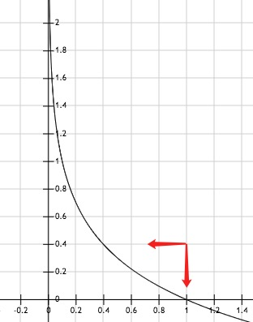
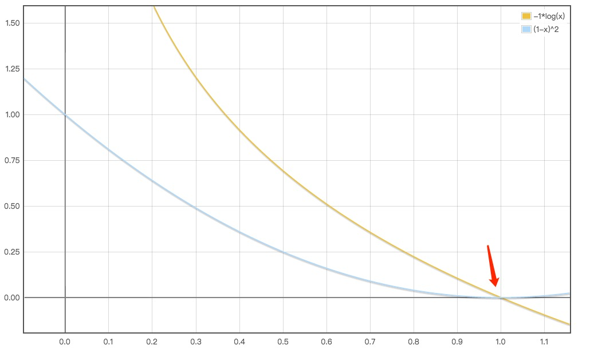
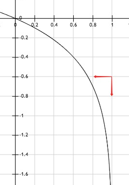

- 概率

    概率就是信任度，和频率有关的，例如骰子，称为频率派概率；医生诊断流感40%的可能性，涉及到确定性水平，为贝叶斯概率。

- 随机变量

    可以为离散或连续，随机变量是对可能的状态的描述，必需伴随一个概率分布来指定状态的可能性。

- 概率分布

    用来描述随机变量的在每一个可能取得的状态的可能性大小

    - 离散型变量和概率质量函数

        通常每一个随机变量都有一个不同的概率质量函数 P(x)。概率质量函数将随机变量能够取得的每个状态映射到随机变量取得该状态的概率。也可以同时作用于多个随机变量，这个称为联合概率 P(x,y)。

    - 连续性变量和概率密度函数

        概率密度函数 p(x) 没有直接对特定状态给出概率，他给出的是落在面积无限小的区域内的概率。可以对概率密度函数求积分来获得点集的真实概率质量。

- 边缘概率

    已知一组变量的联合概率，求其中一个子集的概率分布，该概率分布为边缘概率。也许叫边界或合计更容易理解。

    离散型求解

    $$ P(x=x) = \sum _y P(x=x,y=y) $$

    连续型求解，用积分代替求和

    $$ p(x) = \int p(x,y)dy$$

    >举例：假设P(B),P(C),P(A|B),P(A|C)已知，求P(A)。
    >
    >那么P(A)=sum(P(B)*P(A|B),P(C)*P(A|C))

- 条件概率

    我们想知道某些事件发生时其它事件也发生的概率。我们将事件 B 发生时事件 A 也发生的条件概率写为 P(A|B)。

    在给定其他事件时，求某个指定事件的发生概率。

    $$ P(y=y|x=x) = \frac {P(y=y,x=x)}{P(x=x)}$$

    P(x=x) > 0 才有意义，不能计算永不能发生的事件上的条件概率

    不同于计算一个行为的后果（干预查询/因果模型）。说德语的人有高概率可能是德国人，但并不是说找个会说德语的人，国籍会变为德国，国籍是不可变的。

    >例子1：布袋里有2颗蓝色球和3颗红色球。每次随机冲布袋里拿一颗，记住拿完就不放回布袋了。连续2次拿到蓝球的概率是多少？
    >
    >设定第一次拿篮色球的概率为 $P(A)=\frac 25$，由于不放回，所以第二层拿蓝色球的概率为条件概率，表示为 $P(B|A)=\frac 14$，两次拿蓝色球的概率为第一次拿蓝色球和第二次拿蓝色球的概率和，即：
    >
    >$$P(A,B)=P(A)*P(B|A)=\frac 25*\frac 14=\frac 1{10}$$
    >
    >也就是A(第一次拿蓝球)和B(第二次拿蓝球)的联合概率=A(第一次拿蓝球的概率)乘以B(第二次拿篮球)的概率；由于B是依赖A而存在的，所以记为P(B|A)
    >
    >例子2：在你朋友中，70% 喜欢巧克力冰淇淋，35% 喜欢巧克力和草莓。在喜欢巧克力的人里，也喜欢草莓的百分比是多少？
    >
    >设定喜欢巧克力为事件A，喜欢草莓为事件B，则：
    >
    >$$P(B|A)=\frac {P(A,B)}{P(A)}=\frac {35\%}{70\%}=50\%$$

- 条件概率的链式法则

    任何多个随机变量的联合概率分布都可以分解为只有一个变量的条件概率相乘，又称为乘法法则

    $$ P(a,b,c) = P(a|b,c)P(b,c) $$
    $$ P(b,c) = P(b|c)P(c) $$
    $$ P(a,b,c) = P(a|b,c)P(b|c)P(c) $$

- 独立性和条件独立性

    如果 x,y 的概率分布可以表示成两个因子的乘积，则两个变量是相互独立的。如果x,y的概率对于z的每一个值都可以分解为两个因子的乘积，则为条件独立的。

- 期望、方差和协方差

    函数 f(x) 关于某分布 P(x) 的期望是当x由P产生，f作用于x时，f(x)的平均值。期望是线性的。

    方差是对x按照其概率分布进行采样时，f(x) 的值呈现多大的差异。方差越小，f(x) 越接近期望值。方差的平方根称为标准差。

    无偏方差定义

    $$\sigma^2=\mathbb E[\frac {1}{n-1}\sum _{i=1}^n(X_i-\overline X)^2]$$

    这里是除以n-1而不是n，令$\mu$为实际观测到的期望值：推导如下：

    $$\begin{aligned}
        \mathbb E(\sigma ^2) &= \mathbb E(\frac {1}{n-1}\sum _{i=1}^n(X_i-\overline X)^2)
        \\\\ &= \mathbb E(\frac {1}{n-1}\sum _{i=1}^n(X_i-\mu+\mu-\overline X)^2)
        \\\\ &= \mathbb E(\frac {1}{n-1}\sum _{i=1}^n((X_i-\mu)+(\mu-\overline X))^2)
        \\\\ &= \mathbb E(\frac {1}{n-1}\sum _{i=1}^n((X_i-\mu)^2-2(X_i-\mu)(\overline X-\mu)+(\overline X-\mu)^2))
        \\\\ &= \mathbb E(\frac {1}{n-1}(\sum _{i=1}^n(X_i-\mu)^2-2\sum _{i=1}^n(X_i-\mu)(\overline X-\mu)+n(\overline X-\mu)^2))
        \\\\ &= \mathbb E(\frac {1}{n-1}(\sum _{i=1}^n(X_i-\mu)^2-2n(\overline X-\mu)(\overline X-\mu)+n(\overline X-\mu)^2))
        \\\\ &= \mathbb E(\frac {1}{n-1}(\sum _{i=1}^n(X_i-\mu)^2-n(\overline X-\mu)^2))
        \\\\ &= \frac {1}{n-1}(\mathbb E(\sum _{i=1}^n(X_i-\mu)^2)-\mathbb E(n(\overline X-\mu)^2)))      
        \\\\ &= \frac {1}{n-1}(\mathbb E(\sum _{i=1}^n(X_i-\mu)^2)-n(\mathbb E(\overline X-\mu)^2)))                
        \\\\ &= \frac {1}{n-1}(nVar(X)-n(Var(\overline X))  
        \\\\ &= \frac {1}{n-1}(nVar(X)-n(\frac 1n Var(X))         
        \\\\ &= \frac {1}{n-1}(nVar(X)-Var(X))
        \\\\ &= Var(X)
        \\\\ &= \sigma^2
    \end{aligned}$$

    协方差，给出了两个变量线性相关的强度和变量的尺度。协方差的绝对值越大，意味变量值的变化很大，且距离各自的均值很远；如果协方差为正，两个变量都倾向于同时取得较大的值，如果为负，则一个变量为大值，一个变量为小值。如果两个变量相互独立，则协方差为0；

- 常用概率分布

    - 伯努利分布
    
        离散分布，要么1，要么0，又称为2点分布。

        概率质量函数为：

        $$ f(x,p)=p^x(1-p)^{(1-x)}=\begin{cases} p\qquad if\ x=1,\\1-p \qquad if\ x=0 \end{cases} $$

        期望值：

        $$E[X]=\sum _{i=0}^1x_if(x,p)=0+p=p$$

        方差：

        $$Var[X]=\sum _{i=0}^1(x_i-E[X])^2=(0-p)^2(1-p)+(1-p)^2p = p(1-p)$$

        举例，单次投掷硬币或骰子，概率为1/2和1/6。

        这个是单次测试的结果。如果是多次重复试验，这是二项分布。

    - 二项分布

        如果计算，n次试验中正好成功了k的概率，如下：

        $$f(k;n,p)=\frac {n!}{k!(n-k)!}p^k(1-p)^{n-k}$$

        例子：
        
        扔3次骰子，有2次都是6点的概率由多大？

        $$f(2;3,\frac 16)=\frac {3*2*1}{2*1*(1)}(\frac 16)^2(1-\frac 16)^1=\frac {5}{72}$$

        在掷3次骰子中，不出现6点的概率是： 

        $$f(0;3,\frac 16)=\frac {3*2*1}{1*(3*2*1)}(\frac 16)^0(1-\frac 16)^3=\frac {125}{216}$$

        期望值：

        $$ E[X]=np $$

        方差：

        $$ Var[X]= np(1-p) $$

        [演示程序](./code/04-2.py)

    - 多项分布

        是二项式分布的推广。

        某随机试验有k个可能的结局{$A_1,A_2,...,A_k$},分别出现的次数为{$X_1,X_2,...,X_k$},其概率分别是{$p_1,p_2,...,p_k$},那么在n次采样的结果中，$A_1$出现了$n_1$次，$A_2$出现了$n_2$次,....,$A_k$出现了$n_k$次，其中$n_1+n_2+...n_k=n$则：

        $$f(x|p)=\frac {n!}{n_1!...n_k!}p_1^{n_1}...p_k^{n_k}$$
        $$=n!\prod _{i=1}^k\frac {p_i^{n_i}}{n_i!}$$

        举例：

        扔骰子，点数[1-6]出现的次数分别为[1,2,3,4,5,6]时的概率为多杀？其中一共扔了 1+2+3+4+5+6=21 次。

        $$p(x_1=1,x_2=2...,x_{6}=6)=\frac {21!}{1!2!...6!}(\frac 16)^1(\frac 16)^2...(\frac 16)^6$$

    - 分类分布(Mutinoulli 分布)

        在具有k个不同状态的单个离散型随机变量上的分布，k是有限值
        
        因为简单所以和伯努利分布常用

    - 高斯分布

        是连续概率分布，又称正态分布

        概率密度函数为：

        $$ f(x) = \frac {1}{\sigma\sqrt {2\pi}}e^{-\frac {(x-\mu)^2}{2\sigma^2}} $$

        $\mu$是位置参数，觉得分布的位置；方差$\sigma^2$的开平方或标准差$\sigma$等于尺度参数，决定了分布的幅度。

        标准正态分布，是 $\mu=0$ ,$\sigma^2=1$ 的正态分布。

        用的很多，主要大部分的真实情况都符合正态分布；另外具有相同方差的情况下，正态分布具有最大不确定性，所以对于先验知识的干扰最小。

        [实例代码](./code/04-3.py)

    - 指数分布和拉普拉斯分布

        连续概率分布，x为负值时，概率为0

        概率密度函数为：

        $$ f(x;\lambda) = \begin{cases} \lambda e^{-\lambda x}\qquad if\ x\geq 0,\\0 \qquad if\ x<0 \end{cases}  $$

        $\lambda>0$是率参数，每单位时间发生该事件的次数。

        期望值：

        $$ E[X] = \frac {1}{\lambda} $$

        方差：

        $$ D[X] = \frac {1}{\lambda^2} $$

        拉普拉斯分布为双指数分布，尾端比正态分布更平缓

    - 狄拉克分布和经验分布

        狄拉克分布为1个点，除零以外的点上都是零，但积分是1。可以当做一个脉冲

        狄拉克分布通常作为经验分布的组成部分。经验分布函数是在所有n个数据点上都跳跃1/n的阶跃函数，阶梯状。

    - 分布的混合

        经验分布就是多个狄拉克分布的组成。混合模型引入了潜变量的概念。

        常见的混合模型是高斯混合模型，其是概率密度的万能近似器。任何平滑的概率密度都可以用足够多组件的高斯混合模型以任意精度来逼近。

    - 常用函数的有用性质

        - logistic sigmoid 函数
        
        $$ f(x) = \frac {1}{1+e^{-x}} $$

        最初是指数增长，后面变得饱和，对输入不敏感增长变慢，值区间0~1，当输入在[-1,1]之间时，函数变化敏感，一旦超过就饱和

        - tanh

        $$ f(x) = \frac {e^x-e^{-x}}{e^x+e^{-x}}$$

        近似于sigmoid函数，但后端能保持非线性变化，延迟了饱和期，用的多，sigmoid 已经少用，饱和区间很容易由于变化太小造成梯度消失。

        - relu 函数

        $$ f(x) = max(0,x) $$

        - softplus 函数

        $$ f(x) = log(1+e^x) $$

        softplus 是 relu 的平滑, 但relu会是一部分神经元输出为0，造成网络的稀疏性，减少过拟合。

        - softmax 函数

        $$ \sigma(z)_j= \frac {e^{z_j}}{\sum _{k=1}^Ke^{z_k}}$$

        也就是离散数据归一化，将任意向量压缩到(0,1)区间，并让所有元素之和为1. 特点是反向传播时求偏导简单快速。

    - 贝叶斯规则

        $$ P(x|y)=\frac {P(x)P(y|x)}{P(y)} $$

        上述公式是已知 P(y|x) 求 P(x|y)， $P(y)=\sum _xP(y|x)P(x)$ 计算。
        
        >例子： 假设一个常规的检测结果的敏感度与可靠度均为99%，即吸毒者每次检测呈阳性（+）的概率为99%。而不吸毒者每次检测呈阴性（-）的概率为99%。从检测结果的概率来看，检测结果是比较准确的，但是贝叶斯定理却可以揭示一个潜在的问题。假设某公司对全体雇员进行吸毒检测，已知0.5%的雇员吸毒。请问每位检测结果呈阳性的雇员吸毒的概率有多高？
        >
        >令“D”为雇员吸毒事件，“N”为雇员不吸毒事件，“+”为检测呈阳性事件。可得
        >
        >- P(D)代表雇员吸毒的概率，不考虑其他情况，该值为0.005。因为公司的预先统计表明该公司的雇员中有0.5%的人吸食毒品，所以这个值就是D的先验概率。
        >- P(N)代表雇员不吸毒的概率，显然，该值为0.995，也就是1-P(D)。
        >- P(+|D)代表吸毒者阳性检出率，这是一个条件概率，由于阳性检测准确性是99%，因此该值为0.99。
        >- P(+|N)代表不吸毒者阳性检出率，也就是出错检测的概率，该值为0.01，因为对于不吸毒者，其检测为阴性的概率为99%，因此，其被误检测成阳性的概率为1 - 0.99 = 0.01。       
        >
        >得： 
        >
        >$$ P(D|+) = \frac {P(+|D)P(D)}{P(+)} $$
        >$$ = \frac {P(+|D)P(D)}{P(+|D)P(D)+P(+|N)P(N)} $$
        >$$ = \frac {0.99 * 0.005} {0.99*0.005+0.01*0.995} $$
        >$$ = 0.3322 $$
        >
        >尽管吸毒检测的准确率高达99%，但贝叶斯定理告诉我们：如果某人检测呈阳性，其吸毒的概率只有大约33%，不吸毒的可能性比较大。假阳性高，则检测的结果不可靠。

    - 连续型变量的技术细节

        零测度集在度量空间不占体积

        某性质几乎处处存在，是指在零测度集外都成立

        y=g(x),g是连续可微的函数，$P_y(y)=P_x(g^{-1}(y))$ 不成立，应该为$P_y(y)=P_x(g^{-1}(y))\left| \frac {\partial g\left( x\right) }{\partial x}\right|$

    - 信息论

        信息论的基本思路是，一个不太可能发生的事件比一个非常可能发生的事件能提供更多的信息。

        熵是对不确定的度量，熵越高越混乱，越低越有序。

        定义一个x=x自信息为：

        $$ I(x)= -log P(x) $$

        单位是奈特(nats)，1 奈特是以1/e的概率观测到一个事件时获得的信息量。有些地方用 2 为底数，称为比特或香农。

        

        如图，概率越小，香农熵越高，当概率为1时，香农熵为0.

        - 信息熵

            信息熵的定义

            $$H(X)=-\sum p(x)\log p(x)$$

            针对二分类的情况，则表示为：

            $$H(X)=-(p(x)\log p(x)+p(1-x)\log p(1-x)$$

            一个分布的信息熵是指遵循这个分布的事件所产生的期望信息总量。

            如果x是连续的，香农熵又称为微分熵。

        - 相对熵

            相对熵又称为KL散度或KL距离，并不是真正的距离，是非对称的

            $$ D_{kl}(p||q) <> D_{kl}(q||p)   $$

            $$ D_{kl}(p||q) = \sum _{x\in X} p(x)log \frac {p(x)}{q(x)} = H(p,q)-H(p)$$

            H(p,q) 就是 p，q的交叉熵。

            该值越低，概率q越接近样本集概率p；完全相同，相对熵为0

            为了保证连续性，约定：

            $$ 0log\frac {0}{0}=0,\ 0log\frac {0}{q}=0,\ plog\frac{p}{0}=\infty$$

            因为KL散度不具有交换性，所以不能理解为“距离”的概念，衡量的并不是两个分布在空间中的远近，更准确的理解还是衡量一个分布相比另一个分布的信息损失

            通常可以将相对熵视为交叉熵，因为真实分布p是固定的，D(p||q)由H(p,q)决定。

        - 交叉熵

            交叉熵主要是用于度量两个概率分布间的差异性信息。相当于将相对熵中的H(p)视为0，也成为最小化KL距离。

            $$ H(p,q)<>H(q,p)$$

            离散分布的交叉熵

            p:真实样本分布，q待估计的模型，参数服从(0-1))： 
            
            $$ H(p,q)=-\sum _{x\in X}p(x)log\ q(x) $$
            $$ = -[P_p(x=1)logP_q(x=1)+Pp(x=0)logP_q(x=0)] $$
            $$ = -[plogq+(1-p)log(1-q)] $$
            $$ = -[ylogh_\theta(x)+(1-y)log(1-h_\theta(x))] $$

            对所有样本取均值：

            $$ -\frac {1}{m}\sum _{i=1}^m[y^{(i)}logh_\theta(x^{(i)})+(1-y^{(i)})log(1-h_\theta(x^{(i)}))]$$

            连续分布的交叉熵：

            $$ -\int _x P(x)log\ Q(x)dr(x)=E_p[-logQ] $$

            限制：

            当 $p(x)\rightarrow 0$时，$p(x)log\ p(x)\rightarrow 0$

            >例子：
            >
            >小明成绩差，考试经常不及格，小王成绩好，经常满分。
            >
            >事件A：小明考试及格的概率为$P(x_A)=0.1$，信息量为：$I(x_A)=-log(0.1)=3.3219$
            >
            >事件B：小王考试及格的概率为$P(x_B)=0.999$，信息量为：$I(x_B)=-log(0.999)=0.0014$
            >
            >假设小明的考试结果是0-1分布$x_A$只有2个值，0不及格，1及格，则某次考试的小明的及格概率只有0.1，计算所有的结果的熵的和为衡量小明考试结果的不确定度，即小明熵：
            >
            >$$H_A(X)=-(p(x_A)log(p(x_A))+(1-p(x_A))log(1-p(x_A)))=-(0.1*log(0.1)+0.9*log(0.9))=0.4690$$
            >
            >对应小王的熵为：
            >
            >$$H_B(X)=-(p(x_B)log(p(x_B))+(1-p(x_B))log(1-p(x_B)))=-(0.999*log(0.999)+0.001*log(0.001))=0.0114$$
            >
            >即小明的考试的预测结果的准确度比小王预测结果的准确度低。
            >
            >如果在有个学生小东的及格概率是0.5，则对应的熵为：
            >
            >$$H_C(X)=-(p(x_C)log(p(x_C))+(1-p(x_C))log(1-p(x_C)))=-(0.5*log(0.5)+0.5*log(0.5))=1$$
            >
            >即，预测小东成绩的准确性更差，基本没法预测。

        - 机器学习中的交叉熵

            逻辑回归中也可以使用MSE即均方误差:

            $$ loss = \frac {1}{m}\sum _{i=1}^m(p_i-q_i)^2 $$

            

            如图，当目标概率为1时，预测概率为0~1时的关系图，当预测概率为0时，均方误差为最大值1，当预测概率接近于1时，均方误差达到最小值0。

            逻辑回归中用交叉熵时，相比均方误差，后期的收敛效果要好，所以优先考虑交叉熵。

            

            如图，当目标的概率为1时，当预测的概率趋近为0时，交叉熵趋近为0；当预测的概率也趋近于1时，交叉熵趋近于负无穷大。所以可以通过最小化交叉熵来使得预测的概率也逼近于1。

            单分类问题：

            $$ loss = -\frac {1}{m}\sum _{i=1}^mp_ilog(q_i) $$

            >例子：
            >
            >| * | 猫 | 青蛙 | 狗 |
            >| ------ | ------ | ------ | ------ |
            >| Label(p) | 0 | 1 | 0 |
            >|  Pred(q) | 0.3 | 0.6 | 0.1|
            >
            >那么：
            >
            >$$loss = -(0*log(0.3)+1*log(0.6)+0*log(0.1))=-log(0.6)=0.7370$$
            
            多批量的loss为所有loss的平均值。

            多分类问题，这里的Pred不是采用softmax计算，采用sigmoid，将每一个节点都归一化到[0,1]之间，由于每个节点只有两种可能，所以是一个二项分布，则简化交叉熵计算：

            $$ loss = -plog(q)-(1-p)log(1-q) $$

            >例子：
            >
            >| * | 猫(A) | 青蛙(B) | 狗(C) |
            >| ------ | ------ | ------ | ------ |
            >| Label(p) | 0 | 1 | 1 |
            >|  Pred(q) | 0.1 | 0.7 | 0.8|
            >
            >那么：
            >
            >$$loss_A = -0*log(0.1)-(1-0)log(1-0.1)=-log(0.9)=0.1520$$
            >$$loss_B = -1*log(0.7)-(1-1)log(1-0.7)=-log(0.7)=0.5146$$
            >$$loss_C = -1*log(0.8)-(1-1)log(1-0.8)=-log(0.8)=0.3219$$
            >$$loss=loss_A+loss_B+loss_C=0.9985$$

            多批量的loss为所有loss的平均值。

    - 结构化概率模型

        如果有3个变量，a、b、c，a影响b，b影响c，但b给定时，a、c之间独立。因此可以将联合概率改为2个变量概率的乘积。

        $$ p(a,b,c) = p(a)p(b|a)p(c|b) $$

        用图来表示这个概率分布的分解时，就称为结构化概率模型或图模型

        分为有向和无向两种