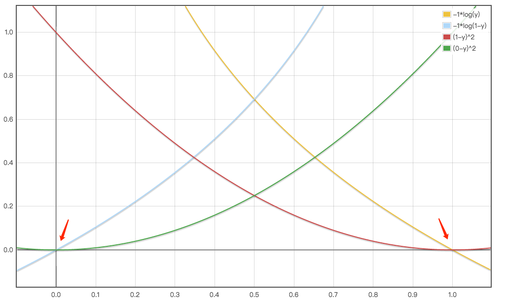

1. 学习算法

    学习的定义：对某类任务T和性能度量P，一个计算机程序被认为可以从经验E中学习是指：通过经验E的改进后，它在任务T上由性能度量P衡量的性能有所提升。

    - 任务T
        样本是指我们从某些希望机器学习系统处理的对象或事件中收集到的已经量化的特征的集合。

        常见任务：

        - 分类

            计算机需要指定某些输入属于k类中的哪一类。例如对象识别。

        - 输入缺失分类

            在输入的度量无法全部保证时，学习算法需要学习一组不同的函数，分别对应不同的子集。例如医学疾病监测。

        - 回归

            对给定的输入输出预测值。例如房价预测。

        - 转录

            非结构数据转为文本。例如OCR和语音识别。

        - 机器翻译

            将语言的符号序列转为另一种语言的符号序列。

        - 结构化输出

            将某数据结构映射到输出相关的元素。例如语法分析。

        - 异常检测

            在一组数据中进行筛选，找出不正常或非典型的个体。例如欺诈检测。

        - 合成和采样

            生成一些和训练样本相似的新样本。如画画或作诗。

        - 缺失值填补

            给定一个新样本，补足其中缺失的元素。

        - 去噪

            输入是干净样本的损坏样本，要求预测干净的样本。

        - 密度估计或概率质量函数估计

            通过学习观察到的数据结构对密度估计。

    - 性能度量 P
        
        通过在测试集上进行对准确率和错误率进行评估

    - 经验 E

        机器学习算法分为无监督算法和监督算法。

    - 示例：线性回归

        $$ \hat {y} =w^Tx $$

        向量$x \in \mathbb R^n$作为输入，预测标量$\hat y \in \mathbb R$为输出，$w \in \mathbb R^n$是参数的向量。

        w可以看做是一组决定每个特征如何影响预测的权重。

        $X^{(test)}$表示测试集，回归目标为$y^{(test)}$

        度量模型的性能第一种办法是在测试集上的均方误差。

        $$ MSE_{test}= \frac {1}{m} \sum _i(\hat y^{(test)}-y^{(test)})^2_i $$

        这个计算式和求欧几里得距离等价，欧几里得距离如下：
        
        $$ MSE_{test}= \frac {1}{m}||\hat y^{(test)}-y^{(test)})||^2_2 $$

        目标是最小化 $MSE_{train}$ ，因此直接求导数为0。

        $$\begin{aligned} 
        &\nabla_wMSE_{train}=0 \\\\
        &\Rightarrow \nabla_w\frac 1m||\hat y^{(train)}-y^{(train)}||^2_2=0 \\\\
        &\Rightarrow \frac 1m\nabla_w||\hat X^{(train)}w-y^{(train)}||^2_2=0 \\\\
        &\Rightarrow \nabla_w(X^{(train)}w-y^{(train)})^T(X^{(train)}w-y^{(train)})=0 \\\\
        &\Rightarrow \nabla_w(w^TX^{(train)T}X^{(train)}w-2w^TX^{(train)T})y^{(train)}+y^{(train)T}y^{(train)})=0 \\\\
        &\Rightarrow 2X^{(train)T}X^{(train)}w-2X^{(train)T}y^{(train)}=0 \\\\
        &\Rightarrow w= \frac {X^{(train)T}y^{(train)}}{X^{(train)T}X^{(train)}}
        \end{aligned}$$      

        这个方程称为正规方程，实际上的线性回归还要加上额外的参数偏置b，即：

        $$\hat y = w^Tx+b$$      

1. 容量、过拟合和欠拟合

    在之前未观测到的输入上表现良好的能力被称为泛化。

    在训练集计算的叫训练误差，机器学习优化是指期望泛化误差（测试误差）的优化问题。

    线性回归采用 $\frac {1}{m^{train}}||X^{(train)}w-y^{(train)}||_2^2$ 

    但我们实际期望 $\frac {1}{m^{test}}||X^{(test)}w-y^{(test)}||_2^2$
        
    按统计学理论，训练集和测试集上，默认为独立同分布假设，就是每个数据集中的样本都是互相独立的，并且训练集和测试集是同分布的。所以可以观察到随机训练误差和测试误差的期望是一致的。

    机器学习的算法效果：

        1. 降低训练误差

        2. 缩小训练误差和测试误差的差距

    针对上面两种目标，引入训练过程中的两个挑战，欠拟合和过拟合。

    可以通过挑战模型的容量，可以控制模型是否偏向于欠拟合或过拟合。模型的容量是指拟合各种函数的能力。

    控制模型训练算法的方法是选择假设空间。广义的线性回归的假设空间包括了多项式函数，而非仅仅线性函数，这样就增加了模型的容量。

    例如：

    一次多项式：

    $$\hat y = wx+b$$

    二次多项式：

    $$\hat y = w_1x^2+w_2x+b$$

    虽然输入的是二次函数，但输出还是线性函数，所以可以解，还可以继续增加，如九次多项式如下：

    $$ \hat y=\sum_{i=1}^9w_ix^i+b $$

    容量高的模型可以解决更复杂的任务，但当容量高于任务所需时，容易发生过拟合。

    学习算法可以从哪些函数族中挑选函数，称为模型的表示容量；在实际过程中，不会去挑一个正好匹配的函数，而是去挑可以大大降低训练误差的函数。并且有时由于算法的不完美，还可能造成学习算法的有效容量可能小于模型族的表示容量。

    提高模型的泛化能力就是奥卡姆剃刀原则，在同样能够解释观察现象的假设中，挑选最简单的那一个。

    统计学习理论提高了量化模型容量的方法叫VC维度。

    对于非参数模型而言，更多的数据会得到更好的泛化性能。

    1. 没有免费的午餐

        机器学习的没有免费的午餐定理表明：在所有可能的数据生成分布上平均之后，每一个分类算法在未事先观测的点上都有相同的错误率。也就是说没有一种机器学习算法总比其他的好。

    2. 正则化

        可以加入权重衰减来修改线性回归的训练标准。带权重衰减的线性回归最小化训练集上的均方误差和正则项的和J(w),其偏好于L2范数较小的权重。如下：

        $$J(w)=MSE_{(train)}+\lambda w^Tw$$

        其中$\lambda$是提前设置好的值，越大，越偏好范数越小的权重。最小化J(w)可以看做拟合训练数据和偏好小权重范数之间的权衡，这样会使得解决方案的斜率较小，或者将权重放到较少的特征少，可以提高泛化能力。

        正则化是指修改学习算法，使其降低泛化误差而非训练误差。

        [参考代码](./code/04-1.py)

1. 超参数和验证集

    预先设置的参数，用来控制算法的行为，例如正则化 $\lambda$

    通常将难以优化的，或不适合在训练集上学习的都设置为超参数；如果在训练集上训练这些超参数，容易导致过拟合。

    用来挑选超参的数据子集被称为验证集。通常80%用来训练，20%用来验证。

    - 交叉验证

        数据过小会导致测试集的误差太小，区分不出算法的优势。可以使用k-折交叉验证算法。

        将数据分为k份来训练，同时将记录每一个误差，求平均。
        
4. 估计、偏差和方差

    - 点估计

        用一些独立的点来估计超参用。其中将输入和目标变量之间关系的估计称为函数估计。

    - 方差和标准差

        设X为服从分布F的随机变量， 如果E[X]是随机变数X的期望值（平均数μ=E[X]）随机变量X或者分布F的方差为：

        $$Var(X)=E[(X-\mu)^2]$$

        连续变量的方差为：

        $$Var(X)=\sigma^2=\int (x-\mu)^2f(x)dx=\int x^2f(x)dx-\mu^2$$

        $\mu$是期望值，$\mu=\int xf(x)dx$

        离散变量的方差为：

        $$Var(X)=\sum ^m_{i=1}p_i(x_i-\mu)^2=\sum ^m_{i=1}(p_ix_i^2)-\mu^2$$

        $\mu$是期望值，$\mu=\sum ^m_{i=1}p_ix_i$

        方差的平方根称为标准差

        均值的标准差记为：

        $$SE(\hat \mu_m)=\sqrt {Var[\frac 1m\sum ^m_{i=1}x_i]}=\frac \sigma{\sqrt m}$$

        以均值 $\hat \mu_m$ 为中心的 95% 的置信空间为：

        $$(\hat \mu_m-1.96SE(\hat \mu_m),\hat \mu_m+1.96SE(\hat \mu_m))$$

        在机器学习中，常说的算法A比算法B好，是指算法A的误差的95%的置信区间的上界小于算法B的误差的95%置信区间的下界。

        在伯努利分布中，估计 $\hat \theta_m=\frac 1m\sum ^m_{x=1} x_i$ 的方差：

        $$Var(\hat\theta_m)=Var(\frac 1m\sum ^m_{x=1} x_i)$$
        $$=\frac 1{m^2}\sum ^m_{x=1} Var(x_i)$$
        $$=\frac 1{m^2}\sum ^m_{x=1}\theta(1-\theta)$$
        $$=\frac 1{m^2}m\theta(1-\theta)$$
        $$=\frac 1{m}\theta(1-\theta)$$

        可以看出方差下降的速度是数据集的样本 m 的函数。

    - 偏差

        估计的偏差定义为：

        $$bias(\hat \theta_m)=\mathbb E(\hat \theta_m)-\theta$$

        $\mathbb E(\hat \theta_m)$是期望值，$\theta$表示真实值。

        如果$bias(\hat \theta_m)=0$,那么估计量$\hat \theta_m$被称为无偏，这意味着$\mathbb E(\hat \theta_m)=0$;如果$\lim _{m\rightarrow\infty } bias(\hat \theta_m)=0$, 估计量$\hat \theta_m$被称为渐进无偏。

        示例 1：伯努利分布，考虑 {$x_1,...,x_m$}:

        $$p(x_i;\theta)=\theta^{x_i}(1-\theta)^{(1-x_i)}=\begin{cases}\theta, \ if\ x=1\\ 1-\theta, \ if\ x=0\end{cases}$$

        $\theta$的常用估计量是训练样本的均值：

        $$\hat \theta_m=\frac {1}{m}\sum _{i=1}^mX_i$$

        下面来判断这个是否有偏：

        $$
        \begin{aligned}
        bias(\hat \theta_m) &= \mathbb E|\hat \theta_m|-\theta \\\\
        &=\mathbb E[\frac {1}{m}\sum _{i=1}^mX_i]-\theta \\\\
        &=\frac {1}{m}\sum _{i=1}^m\mathbb E[x_i]-\theta\\\\
        &=\frac {1}{m}\sum _{i=1}^m\sum _{x_i=0}^1(x_i\theta^{x_i}(1-\theta)^{(1-x_i)})-\theta \\\\
        &=\frac {1}{m}\sum _{i=1}^m(\theta)-\theta \\\\
        &=\theta - \theta=0
        \end{aligned} 
        $$
        
        附期望值计算公式：

        $$\mathbb E[X]=\sum _ix_ip_i$$

        所以骰子的期望值为：

        $$\mathbb E[x]=1*\frac 16+2*\frac 16+3*\frac 16+4*\frac 16+5*\frac 16+6*\frac 16=3.5$$

        示例 2：均值的高斯分布估计

        $$p(x_1;\mu,\sigma^2)=\frac 1{\sigma\sqrt{2\pi}}e^{-\frac {(x_i-\mu)^2}{2\sigma^2}}$$

        高斯分布的期望值推导：

        1. 对偏差的期望值

            $$\mathbb E(X)=\int ^{\infty }_{-\infty }x\frac 1{\sigma\sqrt{2\pi}}exp\{-\frac {(x-\mu)^2}{2\sigma^2} \}dx$$

            令$y=x-\mu$

            $$\mathbb E(X)=\int ^{\infty }_{-\infty }(y+\mu)\frac 1{\sigma\sqrt{2\pi}}exp\{-\frac {y^2}{2\sigma^2} \}dy$$
            $$=\int ^{\infty }_{-\infty }y\frac 1{\sigma\sqrt{2\pi}}exp\{-\frac {y^2}{2\sigma^2} \}dy+\int ^{\infty }_{-\infty }\mu\frac 1{\sigma\sqrt{2\pi}}exp\{-\frac {y^2}{2\sigma^2} \}dy$$

            第一部分用$I_1$表示

            $$I_1=\int ^{\infty }_{-\infty }x\frac 1{\sigma\sqrt{2\pi}}exp\{-\frac {x^2}{2\sigma^2} \}dx$$

            显然这个积分的函数是对称的是奇函数f(x)=−f(−x))，所以对称区间的积分为0，即$I_1=0$。

            所以：

            $$\mathbb E(X)=\int ^{\infty }_{-\infty }\mu\frac 1{\sigma\sqrt{2\pi}}exp\{-\frac {x^2}{2\sigma^2} \}dx$$
            $$=\mu\int ^{\infty }_{-\infty }\frac 1{\sigma\sqrt{2\pi}}exp\{-\frac {x^2}{2\sigma^2} \}dx$$
            $$=\mu\frac 1{\sigma\sqrt{2\pi}}\int ^{\infty }_{-\infty }exp\{-\frac {x^2}{2\sigma^2} \}dx$$
            $$=\mu\frac 1{\sigma\sqrt{2\pi}}\int ^{\infty }_{-\infty }exp\{-\frac {1}{2\sigma^2}x^2 \}dx$$

            >根据高斯积分公式：
            >
            >$$\int ^{\infty}_{\infty}e^{-ax^2+bx+c}dx=\sqrt {\frac \pi a}e^{b^2/4a+c} $$

            $$=\mu\frac 1{\sigma\sqrt{2\pi}} \sqrt {\frac {\pi} {\frac 1{2\sigma^2}}}e^0$$

            $$=\mu\frac 1{\sigma\sqrt{2\pi}}\frac {\sqrt \pi}{\sqrt {\frac 1{2\sigma^2}}}$$
            $$=\mu\frac 1{\sigma\sqrt{2\pi}}\sqrt \pi\sqrt {2 \sigma^2}$$                
            $$=\mu$$

        高斯的均值参数常用估计量称为样本均值：

        $$\hat \mu=\frac 1m\sum _{(i=1)^m}x_i$$

        看是否有偏，计算如下：

        $$\begin{aligned}
        bias(\hat \mu_m)&=\mathbb E|\hat \mu_m|-\mu \\\\
        &=\mathbb E[\frac 1m\sum _{i=1}^mx_i]-\mu \\\\
        &=(\frac 1m\sum _{i=1}^m\mathbb E[x_i])-\mu \\\\
        &=(\frac 1m\sum _{i=1}^m\mu)-u \\\\
        &=\mu-\mu=0
        \end{aligned}$$

        示例 3：高斯分布方差估计
        
        1. 对方差的期望值

            $$V(X)=\int ^{\infty }_{-\infty }(x-\mu)^2\frac 1{\sigma\sqrt{2\pi}}exp\{-\frac{(x-\mu)^2}{2\sigma^2}\}dx$$
            $$=\int ^{\infty }_{-\infty }x^2\frac 1{\sigma\sqrt{2\pi}}exp\{-\frac{x^2}{2\sigma^2}\}dx$$
            $$=\sigma\sqrt 2\int ^{\infty }_{-\infty }(\sigma\sqrt 2x)^2\frac 1{\sigma\sqrt{2\pi}}exp\{-\frac{(\sigma\sqrt 2x)^2}{2\sigma^2}\}dx$$
            $$=\sigma^2\frac 4{\sqrt \pi}\int ^{\infty }_{-\infty }x^2e^{-x^2}dx$$

            另 $t=x^2$， 则 $dt=2xdx=2\sqrt tdx$ ，则$dx=(2\sqrt t)^{-t}dt$ 代入上式：

            $$V(X)=\sigma^2\frac 4{\sqrt \pi}\int ^{\infty }_0(\sqrt t)^2(2\sqrt t)^{-1}e^{-t}dt$$
            $$=\sigma^2\frac 4{\sqrt \pi}\frac 12\int ^{\infty }_0t^{\frac 32-1}e^{-t}dt$$

            >根据伽玛函数积分公式
            >
            >$$\Gamma (z)=\int ^{\infty}_0\frac {t^{z-1}}{e^t}dt=\int ^{\infty}_0 t^{z-1}e^{-t}dt$$
            >
            >$$\Gamma(\frac 32)=\frac 12\sqrt \pi$$

            $$=\sigma^2\frac 4{\sqrt \pi}\frac 12\Gamma(\frac 32)=\sigma^2\frac 4{\sqrt \pi}\frac 12\frac {\sqrt \pi}2=\sigma^2$$

        来比较高斯分布参数$\sigma^2$的两个不同估计

        第一个方差为样本方差，如下：

        $$\hat \sigma_m^2=\frac 1m\sum(x_i-\hat \mu_m)^2$$ 

        $\hat \mu_m$为样本均值

        看是否有偏，计算如下：

        $$\begin{aligned}
        bias(\hat \sigma_m^2)&=\mathbb E[\hat\sigma_m^2]-\sigma^2 \\\\
        &=\mathbb E[\frac 1m\sum _{i=1}^m(x_i-\hat\mu_m)^2]-\sigma^2 \\\\
        &=\frac {m-1}{m}\sigma^2-\sigma^2\\\\
        &=-\frac 1m\sigma^2
        \end{aligned}$$

        所以是有偏估计。

        无偏样本方差估计：

        $$\overline \sigma^2_m=\frac 1{m-1}\sum ^m_{i=1}(x_i-\hat \mu_m)^2$$

        看看是否有偏，计算如下：

        $$\mathbb E[\overline \sigma^2_m]=\mathbb E[\frac 1{(m-1)}\sum ^m_{i=1}(x_i-\hat \mu_m)^2]$$
        $$=\frac m{m-1}\mathbb E[\hat \sigma_m^2]$$
        $$=\frac m{m-1}(\frac {m-1}m\sigma^2)$$
        $$=\sigma^2$$

        所以是无偏估计。

    - 权衡偏差和方差的最小化均方误差

        判断偏差和方差之间的最优，采用的交叉验证，或也可以采用均方误差(MSE)来衡量：

        $$MSE=\mathbb E[(\hat \theta_m-\theta)^2]$$
        $$=Bias(\hat \theta_m)^2+Var(\hat \theta_m)$$

        当用MSE来度量泛化误差时，增加函数容量，会增加方差，降低偏差。

    - 一致性

        一致性保证了估计量的偏差随数据样本的增加而减少。

1. 最大似然估计

    衡量模型函数的估计，最常用的是最大似然估计。就是利用已知的样本结果，反推最有可能（最大概率）导致这样结果的参数值。

    似然和概率不同的，概率是用于在已知一些参数的情况下，预测接下来的观测所得的结果，而似然是用于在已知某些观测所得的结果时，对有关事物的性质的参数进行估算。

    似然函数可以理解为条件概率的逆反。

    在已知参数B，事件A会发生的概率为：

    $$P(A|B)=\frac {P(A,B)}{P(B)}$$

    利用贝叶斯定理得：

    $$P(B|A)=\frac {P(A,B)}{P(A)}=\frac {P(A|B)P(B)}{P(A)}$$

    因此，我们可以反向构造似然，已知有事件A发生，运用似然函数$L(B|A)$,来估计参数B的可能性。

    例子：考虑投掷了三次一枚硬币的实验，观察到二次正面朝上，一次正面朝下，由于硬币的两面不均，需要按观察到的结果估算合理性。

    1. 先假设这枚硬币是公平的，参数B为投掷正面的概率，即$P(B)=0.5$，用似然计算：

        $$L=P(B)*P(B)*(1-P(B))=0.5*0.5*(1-0.5)=0.125$$

    1. 如果$P(B)=0.6$，则重新计算似然为：

        $$L=P(B)*P(B)*(1-P(B))=0.6*0.6*(1-0.6)=0.144$$

    1. 如果$P(B)=0.9$，则重新计算似然为：

        $$L=P(B)*P(B)*(1-P(B))=0.9*0.9*(1-0.9)=0.081$$

    1. 可以发现三个值中，当$P(B)=0.6$时，似然函数L的值最大，因此，$P(B)=0.6$更可靠

    1. 通过求导$\frac {d\theta^2(1-\theta)}{d\theta}=0$计算，找到当L最大值时$P(B)$的值为$P(B)=\frac 23$，因此得出当 $P(B)=\frac 23$ 时是最合理的。

    最大似然估计中采样需满足一个重要的假设，就是所有的采样都是独立同分布的。

    想要确定数据的概率分布，就需要知道概率函数的形式和参数；概率分布的形式已知，所以似然函数既可以用参数$\theta$来表示，如果是高斯分布，参数为$\mu$和$\sigma^2$,即$\theta=(\mu,\sigma^2)$

    $p(x;\theta)$ 是指概率为 $\theta$ 的分布。例如投掷硬币，正面的分布表示为 $p(x;\theta)=0.5$。

    参数估计有两种方法，一种是矩方法，一种是最大似然估计。统计均值就是矩估计，基于大数定理；不过统计学基本都是采用最大似然的方法。

    有一组样本，$x_1,x_2,x_3,...,x_n$ ，其每一个变量都对应一个似然函数：

    $$p(x_1;\theta),p(x_2;\theta),p(x_3;\theta),...,p(x_n;\theta)$$

    那么联合概率密度函数$p(X;\theta)$为($\prod$ 表示乘积运算)：

    $$p(X;\theta)=p(x_1,x_2,...,x_n;\theta)=\prod ^n_{i=1}p(x_i;\theta)$$

    由于$p(X;\theta)$是由$\theta$确定在同空间的概率分布，所以我们就可以用其来估算任意x映射到实数的真实概率。

    下一步就可以使用最大似然估计来估算参数$\theta$了：

    $$\hat\theta_{ML}=arg\max_\theta p(X;\theta)=arg\max_\theta\prod ^n_{i=1}p(x_i;\theta)$$

    由于多个概率相乘不好计算，容易产生数字下溢的问题，所以取对数转为求和的形式：

    $$\hat\theta_{ML}=arg\max_\theta \sum_{i=0}^n \log p(x_i;\theta)$$

    为了方便计算，除以n取平均值，转为:

    $$\hat\theta_{ML}=arg\max_\theta \mathbb E\log p(X;\theta)$$

    >有一种观点是将最大似然看做训练集和模型之间的差异，其差异程度定义为KL散度：
    >
    >$$D_{KL}(\hat p_{train}||p_{model})=\mathbb E_x[\log \hat p_{train}(X;\theta)-\log p_{model}(X;\theta)]$$
    >
    >由于左边的项只是预测结果，与模型无关，所以当我们用最小化KL散度来训练模型时，我们只需要最小化$-\mathbb E_x[\log \hat p_{model}(X;\theta)]$，这个和最大化似然一致。

    为了得到最大值，$\theta_{ML}$的梯度必需为0，即：

    $$\frac {\partial\prod ^n_{i=1}p(x_i;\theta)}{\partial \theta}=0$$

    取对数：

    $$L(\theta)=\log\prod ^n_{i=1}p(x_i;\theta)$$

    $$\frac {\partial L(\theta)}{\partial\theta}
    =\sum_{i=1}^n\frac{\partial\log p(x_i;\theta)}{\partial\theta}
    =\sum_{i=1}^n\frac{1}{p(x_i;\theta)}\frac{\partial p(x_i;\theta)}{\partial\theta}=0
    $$

    例子：一个袋子装有白球和红球，抽取10次，每次抽取后都放回，假设抽到7次白球和3个红球，求袋子中白球的比例。

    直观上应该是70%，以下用最大似然估计来解。

    定义从袋子中抽取白球和红球的概率如下：

    $$p(x_1,...,x_{10};\theta)=p(x_1;\theta)*...*p(x_{10};\theta)$$

    $x_1$为第一次采样，$x_{10}$为第十次采样，p为概率分布，$\theta$为模型参数

    其中 $\theta$ 未知，定义似然 L：

    $$L(\theta)=p(x_1,...,x_{10};\theta)=\prod ^{10}_{i=1}f(x_i;\theta)$$ 

    两边取对数log，取对数是为了将右边的乘号变加号，方便后面求导。

    $$\log L(\theta)=\log(p(x_1,x_2;\theta))=\sum ^{10}_{i=1}\log p(x_i;\theta)$$

    两边取对数后，左边称为对数似然。

    平均对数似然：

    $$\hat e=\frac 1{10}\log L(\theta)$$

    最大似然估计，就是找到一个合适的$\theta$，使平均对数似然最大。

    $$\hat \theta=argmax\hat e(\theta)$$

    定义M为全部集合，白球的概率为$\theta$，红球的概率为($1-\theta$)，因此10次抽到白球7次的概率为：

    $$P(x_1,x_2,...,x_{10}|M)=P(x_1|M)*P(x_2|M)...*P(x_{10}|M)=\theta^7(1-\theta)^3$$

    转换为平均似然：

    $$\hat e=\frac 1{10}\log L(\theta)=\frac 1{10}P(x_1,x_2,...,x_{10}|M)=\frac 1{10}\log(\theta^7(1-\theta)^3)$$

    为了求最大的平均似然，直接对上面求导，导数为0时为最大值。

    $$\hat e'(\theta)=7\theta^6(1-\theta)^3-3\theta^7(1-\theta)^2=0$$
    $$\Rightarrow \theta=0.7 $$

    还可以用展开式计算：

    $$\hat e'(\theta)=\sum_{i=1}^n\frac{1}{p(x_i;\theta)}\frac{\partial p(x_i;\theta)}{\partial\theta}$$
    $$=\sum _{i=1}^7\frac {1}{\theta}\frac{\partial\theta}{\partial\theta}
    +\sum _{i=1}^3\frac {1}{1-\theta}\frac{\partial(1-\theta)}{\partial\theta}=0
    $$
    $$=\sum _{i=1}^7\frac {1}{\theta}*1
    +\sum _{i=1}^3\frac {1}{1-\theta}*(-1)=0
    $$
    $$\Rightarrow \frac 7\theta+(-\frac 3{1-\theta})=0$$
    $$\Rightarrow \theta=0.7 $$

    得：当抽取白球的概率为0.7时，最可能产生10次抽取白球7次的事件。

    最优化 $\theta$ 在最大似然估计或最小化KL散度是相同的，但目标函数值不一样。在机器学习中最大化似然变成最小化负对数似然，或等价的最小化交叉熵。

    - 条件对数似然和均方误差

        最大似然估计很容易扩展到条件概率。

        $$\hat \theta = argmaxP(Y|X;\theta)$$

        如果样本同分布，可以分解为：

        $$\hat \theta = argmax\sum ^m_{i=1}logP(y_i|x_i;\theta)$$

        实例：线性回归作为最大似然

        线性回归采用最小均方误差来计算。现在期望得到条件概率，假定方差为固定的 $\sigma^2$。

        条件对数似然如下：

        $$\hat \theta=\sum ^m_{i=1}\log p(y_i|x_i;\theta)$$
        $$=\sum ^m_{i=1}\log(\frac {1}{\sigma\sqrt{2\pi}}exp(-\frac {(\hat y_i-y_i)^2}{2\sigma^2})$$
        $$=-m\log\sigma-\frac m2\log(2\pi)-\sum ^m_{i=1}\frac {(\hat y_i- y_i)^2}{2\sigma^2}$$

        对比均方误差为：

        $$MSE_{train}=\frac 1m\sum ^m_{i=1}(\hat y_i-y_i)^2$$

        可以看出，最大化w的对数似然和最小化均方误差可以得到相同的参数估计w。但这两种方法有不同值，所以最大似然有不同的性质。

    - 最大似然估计的性质

        最大似然被证明当样本数目趋于无穷大时，就收敛率而言是最好的渐进估计。

        当样本数量较少时，优先考虑最大似然估计；但样本较大时，均方误差和最大似然效果一致。但样本少到发生过拟合时，正则化策略权重衰减可以用在最大似然的有偏版本用于减少方差。

1. 贝叶斯统计

    贝叶斯概率和统计概率相对，它从确定的分布中观测到的频率或者在样本空间中的比例来导出概率。也就是在描述你有多大把握能相信这个事件的发生概率？

    古典统计学的概率是基于大量实验的，例如扔硬币猜正反面，多次后，统计结果，得到近似50%的概率。但小概率事件的确定，没有办法做实验，例如发生地震的概率，没有办法通过大量的实现确定参数导致的概率。

    例子，某种特征，得癌症的测出为阳性的几率为90%，而人群中得癌症的几率为1%。问一个人被测出阳性，得癌症的几率是多少？

    中间有个问题是采用的样本分布不均，所以不能直接得出是90%，需要考虑1%的样本分布。

    我们用A表示测试出阳性，B表示得癌症，B'表示未得癌症，根据如上得：

    $$P(A|B)=0.9,P(A|B')=0.1,P(B)=0.01,P(B')=0.99$$

    那么，已知为阳性的情况，得癌症概率P(B,A),这里表示的是联合概率，等于人群中得癌症的概率乘以得癌症时为阳性的概率:

    $$P(B,A)=P(A|B)*P(B)=0.01*0.9=0.009$$

    同理，未得癌症，但检测出来为阳性的概率为：

    $$P(B',A)=P(A|B')*P(B')=0.99*0.1=0.099$$

    这个概率表示了，1000个人，检查出阳性并得癌症的有9个，检查出阳性未的癌症的有99个。所以看出，检测出阳性并不可怕，与直觉不符。

    所有得阳性的概率为：

    $$P(A)=P(B,A)+P(B',A)=0.099+0.009=0.108$$

    继续计算阳性的癌症的概率，直接将样本中的9和99做归一化得到条件概率：

    $$P(B|A)=\frac {0.009}{0.108}=0.083$$

    阳性未得癌症的概率：
    
    $$P(B'|A)=\frac {0.099}{0.108}=0.917$$

    这个条件概率就是贝叶斯统计的后验概率，而P(B)是先验概率。

    知道先验概率，是否为阳性；再根据观察值，来判断癌症的后验概率，这个就是贝叶斯统计。即，后验概率为：

    $$P(B|A)=\frac {P(A|B)*P(B)}{P(A)}=\frac {P(A|B)*P(B)}{P(A|B)*P(B)+P(A|B')*P(B')}$$

    实例：假设一个学校里有60％男生和40%女生。女生穿裤子的人数和穿裙子的人数相等，所有男生穿裤子。一个人在远处随机看到了一个穿裤子的学生。那么这个学生是女生的概率是多少？

    事件A是看到一个穿裤子的学生，事件B是看到女生，要计算的是P(B|A)

    P(B) 是忽略其他因素，看到女生的概率 40%

    P(B') 是是忽略其他因素，看到男生的概率，60%

    P(A|B) 是女生穿裤子的概率 50%

    P(A|B') 是男生穿裤子的概率 100%

    P(A) 是忽略其他因素，学生穿裤子的概率为：
    
    $$P(A)=P(A|B)*P(B)+P(A|B')*P(B')=0.5*0.4+1*0.6=0.8$$

    则计算后验概率，也就是条件概率为：

    $$P(B|A)=\frac {P(A|B)P(B)}{P(A)}=\frac {0.5*0.4}{0.8}=0.25$$

    将上述的A变成样本x，B 变成参数 $\theta$ 于是得到贝叶斯公式：

    $$p(\theta|x)=\frac {p(x|\theta)p(\theta)}{\sum _ip(x|\theta)p(\theta)}$$

    上面由于$B(\theta)$事件的分布是离散的，所以用到了求和，如果是连续的，则采用积分：

    $$p(\theta|x)=\frac {p(x|\theta)p(\theta)}{\int p(x|\theta)p(\theta)d\theta}$$

    其中 $p$ 是参数的概率分布，$p(\theta)$是先验概率，$p(\theta|x)$是后验概率，$p(x|\theta)$是我们观察到的样本分布，也就是似然函数。

    再说明一下：

    定义已有的样本集合为D，样本集合D中的样本都是从一个固定但是未知的概率密度函数p(x)中独立抽取出来的，要求根据这些样本估计x的概率分布，记为p(x|D)，并且使得p(x|D)尽量的接近p(x)，这个就是贝叶斯估计的核心问题。

    虽然p(x)是未知，但贝叶斯先假设p(x)已知，这样未知的只有参数 $\theta$, 则$p(x|\theta)$是已知的，只是$\theta$未知。这个式子本质上是$\theta$在x处的似然估计。

    由于$\theta$未知，实际计算中可以将$\theta$看做一个随机变量，我们用一个先验概率密度函数$p(\theta)$表示，通过样本训练，我们可以将这个先验概率密度转为后验概率密度函数$p(\theta|D)$，然后我们期望$p(\theta|D)$在$\theta$的真实值附近的置信度比较高，所以得如下公式：

    $$p(x|D)=\int p(x,\theta|D)d\theta=\int p(x|\theta,D)p(\theta|D)d\theta$$

    简化为：

    $$p(x|D)=\int p(x|\theta)p(\theta|D)d\theta$$

    这里的$p(x|\theta)$是$\theta$关于测试样本x这一个点的似然估计，而$p(\theta|D)$是$\theta$在现有样本集合上的后验概率，为：

    $$p(\theta|D)=\frac {p(D|\theta)p(\theta)}{p(D)}=\frac {p(D|\theta)p(\theta)}{\int p(D|\theta)p(\theta)d\theta}$$

    $$p(D|\theta)=\prod _{i=1}^np(x_i|\theta)$$

    贝叶斯估计的增量学习

    $$p(D_n|\theta)=p(x_n|\theta)p(D_{n-1}|\theta)$$

    带入后验概率公式：

    $$p(\theta|D_n)=\frac {p(x_n|\theta)p(D_{n-1}|\theta)p(\theta)}{\int p(x_n|\theta)p(D_{n-1}|\theta)p(\theta)d\theta}=\frac {p(x_n|\theta)p(\theta|D_{n-1})}{\int p(x_n|\theta)p(\theta|D_{n-1})d\theta}$$

    这种学习方式成为参数估计贝叶斯递归法。

    贝叶斯估计和最大似然估计的对比

    假设有一组数据样本 {$x_1,...,x_m$}，通过贝叶斯规则结合数据似然$p(x_1,...,x_m|\theta)$和先验，可以恢复数据对我们关于$\theta$的信念的影响：

    $$p(\theta|x_1,...,x_m)=\frac{p(x_1,...,x_m|\theta)p(\theta)}{p(x_1,...,x_m)}$$

    先验一般是相对均匀或高熵的高斯分布，观察数据会使后验的熵下降，并集中在参数的几个可能性很高的值。

    相对最大似然估计，贝叶斯估计有两个不同，第一，贝叶斯估计的$\theta$是全概率，例如在观察到 m 个样本后，m+1个样本的预测分布如下：

    $$p(x_{m+1}|x_1,...,x_m)=\int p(x_{m+1}|\theta)p(\theta|x_1,...,x_m)d\theta$$
    
    这样每一个具有正概率的$\theta$有助于下一个样本的预测。其中的贡献由后验密度进行加权。
    
    并且前期的不确定性也可以一直包含下去，这样可以防止过拟合。

    第二个不同是贝叶斯的先验概率能够影响概率密度朝先验的区域偏离。先验是人为主观判断影响概率的来源，这样会导致比较好的泛化性能。

    - 贝叶斯线性回归

        确定第$i$个数据集$D_i$，有m个训练样本，构成$(X_i,y_i)$

        线性回归的模型是一组输入变量x的基函数的线性组合，如下：

        $$\hat y(X,w)=w_0+\sum _{i=1}^nw_i\phi_i(X)$$

        $\phi_i(X)$就是基函数，常用基函数有 sigmoid 或 tanh 等， 如果定义$\phi_0=1$，则上式进一步简化为：

        $$\hat y(X,w)=\sum _{i=0}^nw_i\phi_i(X)=w^T\phi(X)$$ 

        则线性模型的概率分布表示如下：

        定义 $\hat y=Xw$

        $$p(y|X,w)=\mathcal N(y;Xw,I)=\mathcal N(y;\hat y,I)$$
        $$\propto \exp(-\frac 12(y-Xw)^T(y-Xw))$$
        $$\propto \exp(-\frac 12(y-\hat y)^T(y-\hat y))$$

        假设参数 w 满足高斯分布，则得到先验分布为：

        $$p(w)=\mathcal N(w;\mu_0,\sigma_0^{-1}I)=\mathcal N(w;\mu_0,\Lambda_0)$$
        $$\propto \exp(-\frac 12(w-\mu_0)^T\Lambda_0^{-1}(w-\mu_0))$$

        由于先验分布和后验分布都采用同样的高斯分布，统称为共轭分布，并称p(w)为共轭先验，y是x的对应的训练样本输出；$\hat y$是x对应的预测输出；$\mu_0$是均值向量；$\sigma_0^{-1}$为w的高斯分布的方差，一般初始化为1；w是参数；$\Lambda_0$是对角协方差矩阵。后面需要通过贝叶斯回归得到目标w的期望。

        线性模型的对数后验分布为：

        $$p(w|X,y)\propto p(y|X,w)p(w)$$
        $$\propto exp(-\frac 12(y-Xw)^T(w-Xw))exp(-\frac 12(w-\mu_0)^T\Lambda _0^{-1}(w-\mu_0))$$
        $$\propto exp(-\frac 12(-2y^TXw+w^TX^TXw+w^T\Lambda_0^{-1}w-2\mu_0^T\Lambda_0^{-1}w))$$    
        
        定义： $\Lambda_i=(X^TX+\Lambda_0^{-1})^{-1}$ 和 $\mu_i=\Lambda_i(X^Ty+\Lambda_0^{-1}\mu_0)$ 则上式可以改写为高斯分布：

        $$p(w|X,y)\propto exp(-\frac 12(w-\mu_i)^T\Lambda_i^{-1}(w-\mu_i)+\frac 12\mu_i^T\Lambda_i^{-1}\mu_i)$$
        $$\propto exp(-\frac 12(w-\mu_i)^T\Lambda_i^{-1}(w-\mu_i))$$

        通常我们设置 $\mu_0=0$。
        
        参数的先验假设可能导致有如下缺点：

        - 参数先验分布的不同假设形式，会照成计算上的不便

        - 参数先验分布的假设有偏，对小数据的影响会很大

        解决办法：

        - 将参数的先验分布假设设置为数据分布的假设的共轭先验。

        - 合理初始化，迭代求解。将前一个数据集得到的参数后验作为先验，不断迭代。
        >$$\begin{aligned}
        &\Lambda_0=0 \\
        &\mu_0=0 \\
        &i=0 \\
        &while\ i<=n: \\
        &\qquad \Lambda_i=(X^TX+\Lambda_{i-1}^{-1})^{-1} \\
        &\qquad \mu_i=\Lambda_i(X^Ty+\Lambda_{i-1}^{-1}\mu_{i-1}) \\
        &\qquad i\ +=\ 1                        
        &\end{aligned}$$

    - 最大后验(MAP)估计

        和贝叶斯估计一样，将参数$\theta$看做一个随机变量，并在已知样本$\{x_1,x_2,\cdots,x_n\}$的条件下，来估计参数$\theta$

        主要是为了简化贝叶斯估计的计算量。

        根据贝叶斯理论，$p(\theta|X)=\frac {p(\theta)p(X|\theta)}{p(X)}$，为了使得后验概率最大，对后验概率函数求导，由于分母p(X)相对于$\theta$是独立的，因此为了简化运算，忽略掉。

        $$\hat \theta _{MAP}=arg\max_\theta p(\theta|X)=arg\max_\theta p(\theta)p(X|\theta)$$
        $$=arg\max_\theta \log p(\theta)+\log p(X|\theta)$$

        为了得到参数$\theta$ 对$p(\theta|X)$求导，使其等于0。

        $$\frac {p(\theta|X)}{d\theta}=\frac {\log p(\theta)+\log p(X|\theta))}{d\theta}$$

        最大后验估计和最大似然的区别就是增加了$p(\theta)$的先验概率分布。可以利用先验的信息，比最大似然能够减少后面的方差，但引入了偏差。

        带权重衰减的最大似然可以理解为最大后验估计的近似。

1. 各损失函数的总结

    - 均方误差

        它衡量的是两个分布对应维度的差异性之和。与之相似的衡量向量的余弦角度，通过计算两个向量的余弦夹角来对比相似度。

        损失函数定义为：

        $$L=\sum(y-\hat y)^2$$

        这里也可以用高斯分布的最大似然来推导出损失函数。

        $$p(x|\mu,\sigma^2)=\prod N(x|\mu,\sigma^2)$$

        取对数：

        $$\log p(x|\mu,\sigma^2)=-\frac 1{2\sigma^2}\sum _{i=1}^n (x_i-\mu)^2-\frac N2log\mu^2-\frac N2log(2\pi)$$

        我们需要得到 $\hat y=\mu$；$x=y$ ，替换得：

        $$\log p(y|\hat y,\sigma^2)=-\frac 1{2\sigma^2}\sum _{i=1}^n (y_i-\hat y_i)^2-\frac n2log\mu^2-\frac n2log(2\pi)$$

        取负数和消除常数项得：

        $$L=\sum(y-\hat y)^2$$

    - 最大似然误差

        对于似然函数而已，并不关心输入的X，所以似然函数的样本集是 $y$，而对应的参数是 $\hat y$。

        似然函数是衡量当前 $\hat y$ 对 $y$ 的解释程度。

        根据多项式分布，所以似然函数为概率分布本身如下：

        $$f(x|p)=\frac {n!}{n_1!...n_k!}p_1^{n_1}...p_k^{n_k}=n!\prod _{i=1}^k\frac {p_i^{n_i}}{n_i!}$$

        得：

        $$L(p|n_1,n_2,...n_{k}) = n! \prod _{i=1}^k\frac {p_i^{n_i}}{n_i!}$$
        
        根据模型定义有如下限制： 
        
        $$n=\sum _{i=0}^k n_i=\sum _{i=0}^k p_i=1$$

        其中 $n_i=y_i$；$p_i=\hat y_i$    

        则：

        $$L(\hat y| y)=\prod _{i=1}^k\frac {\hat y_i^{y_i}}{y_i!}$$   

        对最大似然L取负对数，转为最小化负对数似然

        $$-\log(L)=-\log\prod _{i=1}^k\frac {\hat y_i^{y_i}}{y_i!}$$
        $$=-\sum(y\log(\hat y)-\log(y_i!))$$
        $$=-\sum y\log(\hat y)+\sum \log(y_i!)$$
       
        因为 $y_i$ 是样本目标的 onehot 量
        
        $$L=-\sum y\log(\hat y)+\sum \log(1)$$
        $$=-\sum y\log(\hat y)$$

    - 最大化后验概率

        等价于加了正则项的最大似然误差，它考虑了先验信息，通过对参数值的大小进行约束来防止“过拟合”。

        最大后验概率的定义为：

        $$\hat \theta _{MAP}=arg\max _\theta p(\theta)p(X|\theta)$$

        由于是对比 $y$ 和 $\hat y$，带入上式的：

        $$\hat y=arg\max p(\hat y)p(y|\hat y) $$

        得：$p(\hat y)$为先验概率分布；$p(y|\hat y)$ 为 $\hat y$ 的似然函数则，带入前面的最大似然公式：

        $$p(\hat y)p(y|\hat y)=p(\hat y)L(\hat y|y)$$
        $$=p(\hat y)\prod _{i=1}^k\hat y_i^{y_i}$$

        为了方便计算，对结果取对数得：

        $$\hat \theta _{MAP}=arg\max \log (p(\hat y)L(\hat y|y))$$

        $$=arg\max \log(p(\hat y)\prod _{i=1}^k\hat y_i^{y_i})$$
        $$=arg\max (\log(\prod _{i=1}^k\hat y_i^{y_i})+\log(p(\hat y))$$
        $$=arg\max (\sum \log(\hat y_i^{y_i})+\log(p(\hat y))$$

        则L损失函数为负的最大后验概率

        $$L=-\sum \log(\hat y_i^{y_i})-\log(p(\hat y))$$

        $$=-\sum y\log(\hat y)-\log(p(\hat y))$$

        逻辑回归在训练开始一般定义 $\hat y$ 是平均分布的，所以 $p(\hat y)=1$，则$\log(p(\hat y))=0$

        即：

        $$L=-\sum y\log(\hat y)$$

    - 交叉熵损失函数

        衡量两个分布的相似性，对比熵。具体是计算两个分布的KL散度减去源的熵，由于熵是常量，所以等价于计算KL散度。在分类问题上和最大似然最后的结果一样，都是最小化负对数，相对均方误差，由于是对数，所以在接近边界时的收敛也是很快。

        交叉熵的定义为：

        p:真实样本分布，q待估计的模型，参数服从(0-1))： 
        
        $$ H(p,q)=-\sum _{x\in X}p(x)log\ q(x) $$

        得：

        $$ H(y,\hat y)=-\sum ylog\ \hat y $$

    所以对于机器学习最终合并为两种误差，一种是均方误差（MSE），一种是交叉熵，其中两种都可以用于分类（逻辑回归）问题，但线性回归只能用均方误差。误差函数可以分区间来设置或多种误差累加。

    - 评价

        

        如图，当y为1，x接近于1和当y为0，x接近于0的情况，就可以发现均方误差会出现饱和，而交叉熵会好很多，所以推荐采用交叉熵作为误差函数。

1. 监督学习算法

    监督学习就是给定一组输入x和输出y的训练集，来构建关联输入和输出的映射模型。

    - 概率监督学习

        监督学习都是基于估计概率分布，可以用最大似然来估计参数。

        通过定义一族不同的概率分布，我们可以将线性回归扩展到分类任务上。多元分类可以用 logistic sigmoid 来将线性函数的输出压缩到区间[0,1],从而将这个值解释为概率。这个方法称为逻辑回归。

        线性回归中，可以通过求解方程获得最佳权重；但对于逻辑回归，没有闭解，需要采用梯度下降法来最小化负对数似然来搜索最优解。

    - 支持向量机

        不同于逻辑回归，支持向量机不输出概率，只输出类别，$W^Tx+b$为正就属于正类，为负就是负类。此方法通过定义无限维度的核函数可以高度匹配，但运算量会很大；目前神经网络在基准数据上的测试已经超过此模型。

    - 其他监督学习算法

        - 最近邻回归

            也称K近邻算法，借助于周围K个最近训练的样本的目标值，对测试样本的回归值进行预测。
            
            只要找到离它最近的K个实例，哪个类别最多就是新样本的预测值；
            
            特点：模型简单，但计算量会比较大，依赖大量训练数据，而且分布要均匀。

        - 决策树

            根据数据的属性采用树状结构建立决策模型。将概率的结果分解成树状的决策图，通过计算信息熵来确定该节点的概率，是直观的运用统计概率分析的图法。

    - 无监督学习算法

        无监督学习任务是找到数据的最佳表示。表示常分为低维表示、稀疏表示和独立表示。

        低维表示是将数据压缩到一个较小的表示中，在丢失更少信息的前提下，去除冗余数据；稀疏表示是将数据集嵌入到输入很多为0的表示中，通常用于需要增加表示维度的场合；独立表示是分开数据中变化的来源，使得表示的维度是统计独立的。

        - 主成分分析

            PCA使用线性投影，将输入x映射为z，使用最大方差的方向和新空间的轴对齐。目的是在尽可能少的丢失信息的基础上实现降维。

            将样本X进行预处理，减去均值得到中心化，使得期望值为0，即$\mathbb E[x]=0$，然后确定X对应的无偏样本协方差矩阵如下：

            $$Var[x]=\frac 1{m-1}X^TX$$

            PCA目标是，找到一个Var[z]是对角矩阵的表示，z表示为：$z=W^Tx$

            实例：

            $$A=\begin{bmatrix} 1 & 2 \\ 5 & 4 \\ 3 & 6 \\ 9 & 8 \end{bmatrix}$$

            求PCA分解

            1. 求A的平均值

            $$\overline A=\begin{bmatrix} 4.5 & 5. \end{bmatrix}$$

            2. $A-\overline A$使的期望值为0

            $$C=A-\overline A=\begin{bmatrix} -3.5 & -3 \\ 0.5 & -1 \\ -1.5 & 1 \\ 4.5 & 3 \end{bmatrix}$$

            3. 求C的无偏协方差

            $$cov(C)=\frac 1{4-1}C^TC=\begin{bmatrix}11.67&7.33\\7.33&6.67\end{bmatrix}$$

            4. 求cov(c)的特征值和特征向量

                1. 列多项式

                    $$|\lambda E-A|=\begin{bmatrix}\lambda-11.67&-7.33\\-7.33&\lambda-6.67\end{bmatrix}=0$$
                
                2. 分解多项式

                    $$((\lambda-11.67)*(\lambda-6.67))-(-7.33*-7.33)=0$$
                
                3. 解方程得

                    $$\lambda^2-18.34\lambda+24.11=0$$

                    $$\lambda_1=1.43\ \lambda_2=16.91$$

                    备注：A的行列式等于特征值的乘积。
                
                4. 取绝对值$\lambda$最大的项带入多项式得到特征向量

                    $$\begin{bmatrix}16.91-11.67&-7.33\\-7.33&16.91-6.67\end{bmatrix}x=\begin{bmatrix}5.24&-7.33\\-7.33&10.24\end{bmatrix}\begin{bmatrix}x_1\\x_2\end{bmatrix}=0$$

                    列方程,求$x_1,x_2$的非零解：

                    $$\begin{cases}
                        5.24x_1-7.33x_2=0 \\\\
                        -7.33x_1+10.24x_2=0            
                    \end{cases}$$
                    
                    得：

                    $$x_1=1.40x_2$$

                    PCA要求x的范数为1，即：

                    $$||x||_2=1$$
                    $$\Rightarrow  \sqrt {x_1^2+x_2^2}=1$$

                    两式联合求解的特征向量 x 为：

                    $$x=\begin{bmatrix}0.81\\0.58\end{bmatrix}$$

            5. 将样本投影到特征向量上

                $$PCA(A)=C*x$$

                $$=\begin{bmatrix} -3.5 & -3 \\ 0.5 & -1 \\ -1.5 & 1 \\ 4.5 & 3 \end{bmatrix}*\begin{bmatrix}0.81\\0.58\end{bmatrix}$$

                $$=\begin{bmatrix} -4.575 \\ -0.175 \\ -0.635 \\ 5.385 \end{bmatrix}$$

            以上就完成了降维，我们也可以通过奇异值分解(SVD)来求A的特征向量。

            PCA的作用在于能够将数据变换为元素之间彼此不相关的表示。

            [参考代码](./code/05-1.py)

        - k-均值聚类

            k-均值聚类是将训练集分成k个彼此靠近的不同样本聚类，所以该算法能提供了k维的one-hot编码向量h来表示x。

            one-hot编码，又称为一位有效编码，是将分类变量作为二进制向量的表示。这首先要求将分类值映射到整数值。然后，每个整数值被表示为二进制向量，除了整数的索引之外的都是零值，本身被标记为1，注意在任意时候只有一位有效。

            one-hot编码是一种稀疏表示，因为大部分元素都为0，这种特性会造成数据过于庞大，计算困难，但有益于统计和表达。

            k-均值聚类会初始化k个不同的中心点，然后迭代如下步骤来收敛：

                1. 每个样本分配到最近的中心点所代表的聚类i

                2. 每个中心点更新为聚类i中所有训练样本的均值

            聚类是唯一的分类，对多属性的分类表示很差，实际使用上更偏好分布式表示。分布式表示可以给数据赋予多个分类属性。

            这里有个问题，就是如果初始的k个中心点过近，就很难正确分类，因此 k-均值++ 算法提出，选择的k个中心点应该尽可能远。

            [参考代码](./code/05-2.py)

        - 随机梯度下降

            随机梯度下降是梯度下降的扩展。在机器学习中，如果要得到更好的泛化性能，数据集必需足够大，但造成计算困难。

            针对机器学习常用的负条件对数似然为：

            $$J(\theta)=\mathbb EL(x,y,\theta)=\frac 1m\sum(L(x_i,y_i,\theta))$$

            其中L为每个样本的损失 $L(x,y,\theta)=-\log p(y|x;\theta)$

            计算梯度：

            $$\nabla_\theta J(\theta)=\frac 1m\sum_{i=1}^m\nabla_\theta L(x_i,y_i,\theta)$$  

            如果每次都计算所有的样本，由于样本过大，可能无法计算。

            随机梯度下降就是，将梯度理解为期望，然后用小规模的样本进行近似估计。

            $$\theta_n=\theta_{n-1}-\epsilon g$$

            $\epsilon$是学习率，$g$是每一批样本计算的梯度。

            在实际使用过程中，随着训练抽样样本的批次增加，梯度最终将逐渐收敛到可能的最优测试误差。

        - 构建机器学习算法

            所有的机器学习都有如下组成：数据集、代价函数、优化过程和模型。

            如线性回归的代价函数是负对数似然，模型是$x^Tw+b$，优化算法是求解代价函数梯度为0的方程。

            当然代价函数也可以增加其他项号，例如在负对数似然增加L2的权重正则项：

            $$J(w,b)=\lambda ||w||_2^2-\mathbb E\log P_{model}(y|x)$$

            如果讲模型改为非线性的，就没有闭解，无法直接按梯度为0求解。必需选择一个迭代优化过程，如梯度下降。

            无监督学习，只要只包含x的数据集、适合无监督学习的代价函数和模型即可。

            如果无法直接计算代价函数的梯度，使用近似其梯度进行下降，也可以。

    - 促使深度学习发展的挑战

        - 维数灾难

            高维空间的可配置参数成指数级增长，导致有很多参数没有对应的样本，无法有效的追踪，因此学习上变得困难。

        - 局部不变性和平滑正则性

            最广泛的先验约定是，平滑先验或称为局部不变性先验。就是假设学习的函数不应该在小区域内出现很大的变化。但这种在训练样本不多时，很难做到好的泛化。

            通过引入额外假设生成数据的分布来建立区域间的依赖关系，可以做到非局部的优化，例如迁移学习。深度学习的核心思想是假设数据由多个不同的特征组合，而这些特征来自一个层次结构的多个层级。这种假设提高了泛化性能。这个假设允许了样本数目和可区分区间的数目之间的指数增益。深度的分布式表示，可以解决维数灾难。

        - 流形学习

            流形是连接在一起的区域，流行学习算法通过一个假设来克服这个障碍，该假设认为样本中大部分区域都是无效的输入，有意义的只分布在包含少量数据点的子集构成的一组流形中，而学习函数的输出中，有意义的变化都沿流形的方向。在图像、声音和文本上使用较多，类似序列。
            
            流形有两个特征，第一是集中的概率分布；第二是所遇到的样本与其他样本互相连接，也就是每一个样本都与其他高度相似的样本包围，这样这些高度相似的样本可以通过变换来得到。

            但数据处于低维时，使用流形中的坐标，而非样本空间里的坐标，作为机器学习的数据更为自然。
