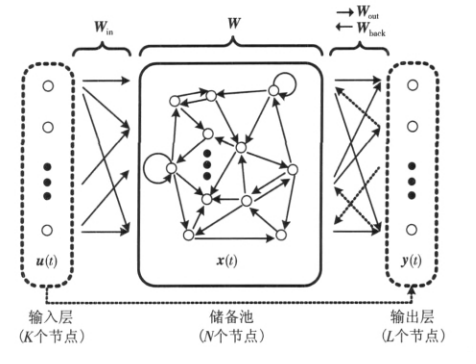

循环神经网络（RNN）是用于处理序列数据的神经网络。

最初是在一维时间序列上使用卷积，这种是时延神经网络的基础，卷积允许网络跨时间共享参数，但是浅层的。卷积输出的是一个序列，其中输出中的每一项是相邻几项输入的函数。参数共享体现在每个时间步使用了相同的卷积核。循环神经网络是不同的，输出的每一项是前一项的函数。输出的每一项对先前的输出应用相同的更新规则而产生，这种循环方式导致参数通过很深的计算图共享。

1. 展开计算图

    动态系统的经典形式：

    $$s_{(t)}=f(s_{(t-1)};\theta)$$

    s 在时刻 t 的定义需要参考 t-1 时刻的同样定义。

    例如对t=3的展开为：

    $$s_3=f(s_2;\theta)=f(f(s_1;\theta);\theta)$$

    引入外部信号$x_{(t)}$，则：

    $$s_{(t)}=f(s_{(t-1)},x_{(t)};\theta)$$

    这样可以看到当前状态包含了整个过去序列的信息

    有时为了表示神经网络的隐藏层，用h代替s为：

    $$h_{(t)}=f(h_{(t-1)},x_{(t)};\theta)$$

    如：

    ```graphviz
    digraph rnn {
        rankdir=LR;
        h [shape=circle]
        x [shape=circle]
        h -> h
        x -> h[label="f"]       
    }
    ```

    展开后为

    ```graphviz
    digraph rnn2{
        rankdir=LR;
        node [margin=0 shape=circle width=0.5 fontsize=10]
        S  [label="h(...)" style=dashed]
        h1 [label="h(t-1)" ]
        h2 [label="h(t)" ]
        h3 [label="h(t+1)" ]
        E  [label="h(...)"  style=dashed]
        x1 [label="x(t-1)" ]
        x2 [label="x(t)" ]
        x3 [label="x(t+1)" ]
        {rank=same; x1; h1}
        {rank=same; x2; h2}
        {rank=same; x3; h3}
        S->h1->h2->h3->E [label="f"]    
        x1->h1 [constraint=false]
        x2->h2 [constraint=false]
        x3->h3 [constraint=false]
    }
    ```

1. 循环神经网络

    循环神经网络的设计模式主要三种：

    - 每个时间步都有输出，并且隐藏单元之间有循环网络

        ```graphviz
        digraph rnn{
            rankdir=LR;
            node [margin=0 shape=circle width=0.5 fontsize=10]
            x->h [label="U"]
            h->h [label="W"]
            h->o [label="V"]
            o->L
            y->L [constraint=false]
            {rank=sink; y}
        }
        ```

        如图，是将输入x的序列，映射到输出o的对应序列，o是未归一化的对数概率，然后softmax(o)，计算损失L，x到rnn的隐藏层权重矩阵是U，rnn隐藏层内部循环的权重矩阵是W，rnn输出到o的权重矩阵是V。

        特点是输入和输出都是同时间步的。

        [演示代码](./code/10-1.py)

    - 每一个时间步都产生一个输出，只有当前时刻的输出到下个时刻的隐藏单元之间有循环连接

        ```graphviz
        digraph rnn{
            rankdir=LR;
            node [margin=0 shape=circle width=0.5 fontsize=10]
            x->h [label="U"]
            h->o [label="V"]
            o->h [label="W"]
            o->L
            y->L [constraint=false]
            {rank=sink; y}
        }
        ```

        这种循环网络是将输出重新反馈到隐藏层，这样由于o是h的未来信息，比起直接在h中反馈，会丢失很多信息，好处是训练容易，可以分离时间步，方便做并行训练。

        [演示代码](./code/10-2.py)

    - 隐藏单元之间做循环连接，但读取完毕整个序列后只产生单个输出的循环网络。

        ```graphviz
        digraph rnn{
            rankdir=LR;
            node [margin=0 shape=circle width=0.5 fontsize=10]
            a [label="..."]
            h1 [label="h(t-3)"]
            h2 [label="h(...)"]
            h3 [label="h(t)"]
            x1 [label="x(t-3)"]
            x2 [label="x(...)"]
            x3 [label="x(t)"]
            o  [label="o(t)"]
            L  [label="L(t)"]
            y  [label="y(t)"]

            a->h1 [label="W"]
            h1->h2 [label="W"]
            h2->h3 [label="W"]
            h3->o [label="V"]
            o->L 
            x1 -> h1 [label="U" constraint=false]
            x2 -> h2 [label="U" constraint=false]
            x3 -> h3 [label="U" constraint=false]
            y->L [constraint=false]

            {rank=same; h1; x1}
            {rank=same; h2; x2}
            {rank=same; h3; x3}
            {rank=sink; y}
        }
        ```

        如图，在序列结束时具有单个的输出，这样可以概括序列，并产生固定大小的表示，方便后续处理。

        [演示代码](./code/10-3.py)

    反向传播：假设使用双曲线函数tanh做为rnn的激活函数，则反向传播如下：

    $$a_{(t)}=b+Wh_{(t-1)}+Ux_{(t)}$$

    $$h_{(t)}=tanh(a_{(t)})$$

    $$o_{(t)}=c+Vh_{(t)}$$

    $$\hat y_{(t)}=softmax(o_{(t)})$$

    b,c为偏置，同时连接权重矩阵 U、V、W；分别对应输入到隐藏层、隐藏层到输出和隐藏层到隐藏层的连接。

    损失函数为：

    $$L((x_1,...,x_t),(y_1,...,y_t))$$

    $$=\sum_t L_t$$

    $$=-\sum_t\log P_{model}(y_t|(x_1,...,x_t))$$

    由于是时间序列，无法并行计算，导致计算损失函数的时间成本很高，这种用于展开图且代价为O(T)的反向传播算法称为通过时间反向传播(BPTT)。

    1. 导师驱动过程和输出神经网络

        只在一个时刻步输出和下一个时间步的隐藏单元相连接，由于缺乏隐藏单元到隐藏单元的连接，不会很强大，但好处在于隐藏单元和隐藏单元进行解耦了，这样训练可以并行化。

        由输出反馈到模型而产生循环连接的模型可用导师驱动过程进行训练，导师驱动过程不适应最大似然准则，而在时刻t+1接收真实值$y_{(t)}$作为输入，即：

        $$logp(y_{(1)},y_{(2)}|x_{(1)},x_{(2)})$$

        $$=logp(y_{(2)}|y_{(1)},x_{(1)},x_{(2)})+logp(y_{(1)}|x_{(1)},x_{(2)})$$
    
        训练网络即：

        ```graphviz
        digraph rnn{
            rankdir=LR;
            node [margin=0 shape=circle width=0.5 fontsize=10]
            y1 [label="y(t-1)"]
            y2 [label="y(t)"]
            l1 [label="L(t-1)"]
            l2 [label="L(t)"]
            o1 [label="o(t-1)"]
            o2 [label="o(t)"]
            h1 [label="h(t-1)"]
            h2 [label="h(t)"]
            x1 [label="x(t-1)"]
            x2 [label="x(t)"]
            x1->h1 [label="U"]
            x2->h2 [label="U"]
            h2->o2 [label="V"]
            h1->o1 [label="V"] 
            o2->l2
            o1->l1
            y2->l2 
            y1->l1 
            y1->h2 [label="W" constraint=false]
            {rank=same; l1; l2}
            {rank=same; o1; o2}
            {rank=same; h1; h2}
            {rank=same; x1; x2}
            {rank=sink; y1;y2}
        }
        ```    

        测试时：

        ```graphviz
        digraph rnn{
            rankdir=LR;
            node [margin=0 shape=circle width=0.5 fontsize=10]
            o1 [label="o(t-1)"]
            o2 [label="o(t)"]
            h1 [label="h(t-1)"]
            h2 [label="h(t)"]
            x1 [label="x(t-1)"]
            x2 [label="x(t)"]
            x1->h1 [label="U"]
            x2->h2 [label="U"]
            h2->o2 [label="V"]
            h1->o1 [label="V"]
            o1->h2 [label="W" constraint=false]
            {rank=same; o1; h2}
            {rank=same; x2; h1}
        }
        ```    

        只要隐藏单元成为较早时间步的函数，BPTT算法是必要的，某些模型需要同时应用导师驱动过程和BPTT算法。

        主要这个模型在预测时下一步的输入完全依赖前一步输出，误差会放大。如果这个模型在开环时使用，即网络输出反馈为输入，那么训练期间看到的输入与测试时看到的输入完全不同。减轻此问题的办法是同时使用导师驱动过程和自由运行的输入进行训练。

        [演示代码](./code/10-4.py)

    1. 计算循环神经网络的梯度

        对每一个节点N，需要基于N后面的节点梯度，递归的计算梯度$\nabla_NL$，从紧接着最终损失的节点开始递归：

        $$\frac {\partial L}{\partial L_t}=1$$

        在这个导数，假设$o_t$是softmax的参数，然后输出为 $\hat y$，后面用负对数似然定义L，则：

        $$(\nabla_{o_t}L)_i=\frac {\partial L}{\partial o_{i,t}}=\frac {\partial L}{\partial L_t}\frac {\partial L_t}{\partial o_{i,t}}=\hat y_{i,t}-1_{i,y_t}$$

        这样从序列的末尾开始，进行反向计算，在最后的时间步$\tau$，$h_{\tau}$只有$o_{\tau}$作为后续节点，即：

        $$\nabla_{h_{\tau}}L=V^T\nabla_{o_{\tau}}L$$

        然后，我们可以从时刻 $t=\tau-1$ 到 $t=1$ 进行反向迭代，注意 $h_t(t<\tau>)$ 同时具有 $o_t$ 和 $h_{t+1}$ 两个后续节点，因此单独处理如下：

        $$\nabla_{h_t}L=(\frac {\partial h_{t+1}}{\partial h_t})^T(\nabla_{h_{t+1}}L)+(\frac {\partial o_t}{\partial h_t})^T(\nabla_{o_t}L)$$

        $$=W^T(\nabla_{h_{t+1}}L)diag(1-(h_{t+1})^2)+V^T(\nabla_{o_t}L)$$

        其中 $diag(1-(h_{t+1})^2)$ 表示包含元素 $1-(h_{i,t+1})^2$ 的对角矩阵。这个是关联t+1时刻和i个隐藏层的双曲正切的雅可比矩阵。

        获得计算图的内部节点梯度后，就可以得到参数节点的梯度。

        $$\nabla_c L=\sum_t(\frac {\partial o_t}{\partial c})^T\nabla_{o_t}L=\sum_t\nabla_{o_t}L$$

        $$\nabla_b L=\sum_t(\frac {\partial h_t}{\partial b_t})^T\nabla_{h_t}L=\sum_t diag(1-h_t^2)\nabla_{h_t}L$$

        $$\nabla_V L=\sum_t\sum_t(\frac {\partial L}{\partial o_{i,t}})\nabla_Vo_{i,t}=\sum_t(\nabla_{o_t}L)h_t^T$$

        $$\nabla_W L=\sum_t\sum_t(\frac {\partial L}{\partial h_{i,t}})\nabla_{W_t}h_{i,t}$$

        $$=\sum_t diag(1-h_t^2)(\nabla_{h_t}L)h_{t-1}^T$$

        $$\nabla_U L=\sum_t\sum_t(\frac {\partial L}{\partial h_{i,t}})\nabla_{U_t}h_{i,t}$$

        $$=\sum_t diag(1-h_t^2)(\nabla_{h_t}L)x_t^T$$

    1. 作为有向图模型的循环网络

        前面的损失函数$L_t$都是$y_t$和$o_t$之间的交叉熵。当然rnn也可以将输出解释为一个概率分布，如果用单位高斯分布的交叉熵定义损失，就是均方误差。

        如果一个时间步输入都预测对应的一个时间步输出，则为根据之前的输入估计下一个序列元素$y_t$的条件分布，则最大化对数似然为：

        $$log p(y_t|x_1,...,x_t)$$

        量与量之间有依赖关系，就是有向图，即：如果模型的来自一个时间步输出到下一个时间步的连接则为：

        $$log p(y_t|x_1,...,x_t,y_1,...y_{t-1})$$

        如果我们反馈真实的y给网络，那么有向图模型包含了所有过去$y_i$到$y_t$的边。

        假设没有x的输入，单纯考虑$\mathbb Y=\{y_1,...y_t\}$ 的RNN模型，则概率为：

        $$P(\mathbb Y)=P(y_1,...y_\tau)=\prod_{t=1}^{\tau} P(y_t|y_{t-1},y_{t-2},...,y_1)$$

        其中当$t=1$，条件概率的右侧为空。因此对于这个模型的$\mathbb y$的负对数似然为：

        $$L=\sum_t L_t$$

        其中

        $$L_t=-log P(\hat y_t-y_t|y_{t-1},y_{t-2},...,y_1)$$

        上面表示$y_t$直接全部其他变量，不过有些模型为了提高统计和计算效率，做Markov假设，$y_t$只与$\{y_{t-k},...,y_{t-1}\}$ 相关。有些情况下，但我们认为$y_t$的分布可能取决于遥远的过去$y_i$的值，且无法从$y_{t-1}$获得影响时，RNN很有用。

        当序列很长时，相比全连接，RNN可以通过高效的参数化获得相同的全连接。RNN由于参数共享，直接可以通过调整RNN的参数量就可以控制模型的容量，而不用去管序列的长度与否。

        RNN为了减少的参数数目付出的代价就是优化参数变得非常困难。

        RNN共享参数的前提是相同的参数可以用于不同的时间步，这里要求，从t到t-1的后续条件概率的分布是平稳的，也就是 t-1 和 t+1 的关系并不依赖 t。

        全连接和RNN的对比图：

        全连接:

        ```graphviz
        digraph fc{
            rankdir=LR;
            node [margin=0 shape=circle width=0.5 fontsize=10]
            y6 [label="y..."]
            y1->y2->y3->y4->y5->y6
            
            y1->{y3,y4,y5} [constraint=false]
            y2->{y4,y5} [constraint=false]
            y3->y5 [constraint=false]
            {y1,y2,y3,y4} -> y6 [constraint=false style=dashed]
        }
        ```    

        RNN:

        ```graphviz
        digraph rnn{
            rankdir=LR;
            node [margin=0 shape=circle width=0.5 fontsize=10]
            h1->h2->h3->h4->h5
            h5-> h6 [style=dashed] 
            y6 [label="y..."]
            h6 [label="h..."]
            
            y1->h1 [constraint=false]
            h1->y2 [constraint=false]
            y2->h2 [constraint=false]
            h2->y3 [constraint=false]
            y3->h3 [constraint=false]
            h3->y4 [constraint=false]
            y4->h4 [constraint=false]
            h4->y5 [constraint=false]
            y5->h5 [constraint=false]
            h5->y6 [constraint=false style=dashed]
            {rank=same; h1; y1}
            {rank=same; h2; y2}
            {rank=same; h3; y3}
            {rank=same; h4; y4}
            {rank=same; h5; y5}
            {rank=same; h6; y6}
        }
        ```          

        针对长短不一的时间序列输出，例如词汇表之类的，可以正词汇表的最后一项多增加一个终止符，表示输出结束；另外一种模型是在模型中引入额外的伯努利输出，表示每个时间步决定继续生成或终止生成。后者更普遍。新的伯努利输出通常使用 Sigmoid 函数，并通过交叉熵来训练。

        控制输出序列长度的另一个办法是，直接将长度本身加到模型，直接回归长度整数，这样在输入的时候，需要引入到结束的长度，让循环更新时，知道是否靠近所产生序列的末尾，分解概率如下：

        $$P(x_1,...,x_{\tau})=P(\tau)P(x_1,...,x_{\tau}|\tau)$$

    1. 基于上下文的RNN序列建模

        上一节是没有x的，直接用y的RNN建模，这一节是直接将x作为单个固定大小的向量作为输入。如上，可以直接简单的将x作为y序列RNN的额外输入。

        将额外输入提供到RNN的一些常见方法是：

        1. 在每个时刻作为一个额外输入
        
        1. 作为初始状态$h_0$输入

        1. 结合这两种方式

        最常见的方法是：

        ```graphviz
        digraph rnn{
            rankdir=BT;
            node [margin=0 shape=circle width=0.5 fontsize=10]
            x->h0 [label="R" style=dashed]
            x->{h1,h2,h3} [label="R"]
            x->h4 [label="R" style=dashed]
            h0->h1 [label="W" style=dashed]
            h3->h4 [label="W" style=dashed]
            h1->h2->h3 [label="W"]
            h1->o1 [label="W"]
            o1->L1
            h2->o2 [label="W"]
            o2->L2
            h3->o3 [label="W"]
            o3->L3
            y1->h2 [label="U"]
            y1->L1
            y2->h3 [label="U"]
            y2->L2
            y3->h4 [label="U" style=dashed]
            y3->L3 

            h0 [label="h(...)"]
            h4 [label="h(...)"]
            h1 [label="h(t-1)"]
            h2 [label="h(t)"]
            h3 [label="h(t+1)"]
            o1 [label="o(t-1)"]
            o2 [label="o(t)"]
            o3 [label="o(t+1)"]
            L1 [label="L(t-1)"]
            L2 [label="L(t)"]
            L3 [label="L(t+1)"]
            y1 [label="y(t-1)"]
            y2 [label="y(t)"]
            y3 [label="y(t+1)"]

            {rank=same; x}
            {rank=same; h0;h1;h2;h3;h4}
            {rank=same; o1;o2;o3}
            {rank=same; L1;L2;L3}
            {rank=sink; y1;y2;y3}
        }
        ```          
        
        [演示代码](./code/10-5.py)

        如图，输入x和每个隐藏单元h之间通过新引入的矩阵权重R参数化的。同样的乘积$x^TR$作为第一个隐藏单元$h_0$, 这种模型适合做图形标注或文章摘要等。

        下面是向量序列的输入，之前是将y直接作为h输入，现在y加了一个权重加入即：

        ```graphviz
        digraph rnn{
            rankdir=BT;
            node [margin=0 shape=circle width=0.5 fontsize=10]
            x1->h1 [label="U"]
            x2->h2 [label="U"]
            x3->h3 [label="U"]
            h0->h1 [label="W" style=dashed]
            h3->h4 [label="W" style=dashed]
            h1->h2->h3 [label="W"]
            h1->o1 [label="W"]
            o1->L1
            h2->o2 [label="W"]
            o2->L2
            h3->o3 [label="W"]
            o3->L3
            y1->L1
            y1->h2 [label="R"]
            y2->L2
            y2->h3 [label="R"]
            y3->L3
            y3->h4 [label="R" style=dashed]

            x1 [label="x(t-1)"]
            x2 [label="x(t)"]
            x3 [label="x(t+1)"]
            h0 [label="h(...)"]
            h4 [label="h(...)"]
            h1 [label="h(t-1)"]
            h2 [label="h(t)"]
            h3 [label="h(t+1)"]
            o1 [label="o(t-1)"]
            o2 [label="o(t)"]
            o3 [label="o(t+1)"]
            L1 [label="L(t-1)"]
            L2 [label="L(t)"]
            L3 [label="L(t+1)"]
            y1 [label="y(t-1)"]
            y2 [label="y(t)"]
            y3 [label="y(t+1)"]

            {rank=same; x1;x2;x3}
            {rank=same; h0;h1;h2;h3;h4}
            {rank=same; o1;o2;o3}
            {rank=same; L1;L2;L3}
            {rank=sink; y1;y2;y3}
        }
        ```  

        如图，将可变长度的x值序列映射到相同长度的y值序列上分布的条件循环神经网络。

        这样可以做到x和y的概率分布不一样，而之前简单的rnn模型要求x和y的概率同分布。

        [演示代码](./code/10-6.py)

1. 双向 RNN

    如果输出的y的预测，依赖整个输入序列，就是x序列的后面对y的前面造成影响，例如翻译的倒装语句。则利用双向循环神经网络。

    双向RNN结合了时间上从序列起点向前移动和在另一个时间上从序列最后向后移动。

    ```graphviz
    digraph drnn{
        rankdir=BT;
        node [margin=0 shape=circle width=0.5 fontsize=10]
        
        x1->h1 
        x2->h2 
        x3->h3 
        h1->h2->h3 
        g3->g2->g1  [constraint=false]
        h1->o1 
        g1->o1  
        x1->g1 [constraint=false]
        o1->L1
        y1->L1
        h2->o2 
        g2->o2 
        x2->g2 [constraint=false]
        o2->L2
        y2->L2
        h3->o3 
        g3->o3
        x3->g3 [constraint=false]
        o3->L3
        y3->L3            


        x1 [label="x(t-1)"]
        x2 [label="x(t)"]
        x3 [label="x(t+1)"]
        h1 [label="h(t-1)"]
        h2 [label="h(t)"]
        h3 [label="h(t+1)"]
        g1 [label="g(t-1)"]
        g2 [label="g(t)"]
        g3 [label="g(t+1)"]
        o1 [label="o(t-1)"]
        o2 [label="o(t)"]
        o3 [label="o(t+1)"]
        L1 [label="L(t-1)"]
        L2 [label="L(t)"]
        L3 [label="L(t+1)"]
        y1 [label="y(t-1)"]
        y2 [label="y(t)"]
        y3 [label="y(t+1)"]

        {rank=same; x1;x2;x3}
        {rank=same; h1;h2;h3}
        {rank=same; g1;g2;g3}
        {rank=same; o1;o2;o3}
        {rank=same; L1;L2;L3}
        {rank=sink; y1;y2;y3}
        
    }
    ```

    如图展示的双向RNN，其中$h_t$代表前向移动的RNN状态，$g_t$代表后向移动的RNN状态，这样输出单元$o_t$能够同时依赖于过去和未来时刻$t$的输入值最敏感的表示。，当然这种方式可以描述为卷积方式，计算自底向上到每一层的输入。

    [参考代码](./code/10-7.py)

1. 基于编码 - 解码的序列到序列架构

    前面是输出定长或等长序列的RNN模型，本节是讲将输入序列映射到不定长的输出序列。

    编码-解码或序列到序列架构如下：

    1. 编码器或读取器或输入 RNN 处理输入序列。编码器输出上下文C，通常是最终隐含状态的简单函数。

    1. 解码器或写入器或输出 RNN 则是以固定长度的向量为条件产生输出序列 Y。

    在序列到序列的架构中，两个RNN共同训练以最大化$log P(y_1,...y_n)|(x_1,...,x_t)$，编码器的输出$h_n$为解码器的输入。

    编码器：

    ```graphviz
    digraph rnn_encode{
        rankdir=BT;
        node [margin=0 shape=circle width=0.5 fontsize=10]

        h1->h2->h3->C
        x1->h1
        x2->h2
        x3->h3
        {rank=same; h1;h2;h3;C}
        {rank=same; x1;x2;x3}

        x1 [label="x(t-1)"]
        x2 [label="x(t)"]
        x3 [label="x(t+1)"]
        h1 [label="h(t-1)"]
        h2 [label="h(t)"]
        h3 [label="h(t+1)"]
    }
    ```

    解码器：

    ```graphviz
    digraph rnn_decode{
        rankdir=BT;
        node [margin=0 shape=circle width=0.5 fontsize=10]

        h0->h1 [style=dashed]
        h1->h2->h3
        h1->y1
        h2->y2
        h3->y3
        y1->h2
        y2->h3
        C->h0 [style=dashed]
        C->{h1,h2,h3}  
        {rank=same; h0;h1;h2;h3}
        {rank=same; y1;y2;y3}
        {rank=same; C}

        y1 [label="y(t-1)"]
        y2 [label="y(t)"]
        y3 [label="y(t+1)"]
        h0 [label="h(0)"]
        h1 [label="h(t-1)"]
        h2 [label="h(t)"]
        h3 [label="h(t+1)"]
    }
    ```

    如果上下文C是一个向量，则可以作为RNN的初始状态或直接连接到RNN的每个时间步，两种方式结合也可以。

    这种架构的不足是，编码器RNN的输出的上下文C的维度太小，很难表示一个长序列。因此有架构将C成为一个可变长度的序列而不是固定长度的大小和引入了注意力机制。

1. 深度循环网络

    RNN一般分解为3个部分

    - 从输入到隐藏单元

    - 从前一个隐藏单元到下一个隐藏单元

    - 从隐藏单元到输出

    有两种方式来变的更深：

    1. 将隐藏循环分解为具有层次的组，也就是多个RNN串联。

    2. 在输入到隐藏层、隐藏到隐藏层、隐藏层到输出，中间引入更深的计算。

    多层是有用的，但太深导致优化困难，导致学习效果变差，可以考虑在隐藏到隐藏的路径中引入跳跃连接来缓和这个问题。

1. 递归神经网络

    递归神经网络是树状结构，而不是RNN的链状结构。主要用于学习推论。

    ```graphviz
    digraph rnn_iteration{
        rankdir=LR;
        node [margin=0 shape=circle width=0.5 fontsize=10]

        x1->a1 [label="V"]
        x2->a2 [label="V"]
        x3->a3 [label="V"]
        x4->a4 [label="V"]
        a1->b1 [label="U"]
        a2->b1 [label="W"]
        a3->b2 [label="U"]
        a4->b2 [label="W"]
        b1->c [label="U"]
        b2->c [label="W"]
        c->o->L
        y->L
       
        {rank=same; x1;x2;x3;x4}
        {rank=same; a1;a2;a3;a4}
        {rank=same; b1;b2}

        a1 [label=""]
        a2 [label=""]
        a3 [label=""]
        a4 [label=""]
        b1 [label=""]
        b2 [label=""]
        c [label=""]

    }
    ```

    这种架构是为了在降低网络复杂度的情况下解决长期依赖问题。

    但这种数结构的构造是问题，期望机器学习可以自行发现和推断适合于任意给输入的树结构。

1. 长期依赖的挑战

    长期依赖的问题是大部分倾向于梯度消失，少部分是梯度爆炸。即使控制了梯度，由于是长期依赖的权重比短期涉及到更多的指数级减少，所以反向传播很困难。

    由于循环网络还涉及到相同非线性激活函数的多次组合（$a^t$ 激活函数的t次方），最后导致极端非线性行为，导致梯度小于1会衰减到0，大于1会激增。

    如果用一个精心设计的W（均值0，方差v）初始参数，将方差设置为期望方差的n次开方 $v=\sqrt [n] v$ 可以避免梯度消失或爆炸。

    一方面需要捕获长期依赖关系，一方面需要避免梯度的优化变得困难，SGD 的优化仅仅在长度为10或20的序列可以正常收敛。

1. 回声状态网络

    由于RNN的学习权重很困难，所以提出，设定循环隐藏单元，使其更好的捕捉输入历史，并只学习输出权重。与RNN的不同之处是将输入到隐藏层，隐藏层到隐藏层的连接权值随机初始化并且固定。只训练输出连接权值。由于只训练输出层，不需要BP，训练过程就成了求线性回归，所以非常快。

    回声状态网络（ESN）和流体状态机都被称为储层计算，因为隐藏单元形成了可能捕获历史不同方面的临时特征池。

    储层计算为：将任意长度的序列$x_t$映射为一个长度固定的向量，循环状态为$h_t$，之后施加一个线性预测算子（通常是线性回归）以解决感兴趣的问题。这样很容易将训练准则设计为输出权重的凸函数。例如：从隐藏单元到输出目标的线性回归，则训练准则就是均方误差，这个是凸的，SGD可以很容易解决。

    

    计算步骤：

    - 确定储备池大小

    - 随机生成连接矩阵

    - 缩放矩阵，使其特征值谱半径（为特征值的最大绝对值）小于1，这样会导致偏差呈指数减少，从而达到收缩映射。

    - 随机生成输入连接和输出反馈权重

    - 用线性回归确定输出连接权重

    储层计算的策略就是简单的固定权重，使其谱半径小于1，信息前向传播时，由于引入了饱和非线性单元，如tanh，于是稳定在(-1,1)，不会发生梯度爆炸。

    [演示代码](./code/10-8.py)